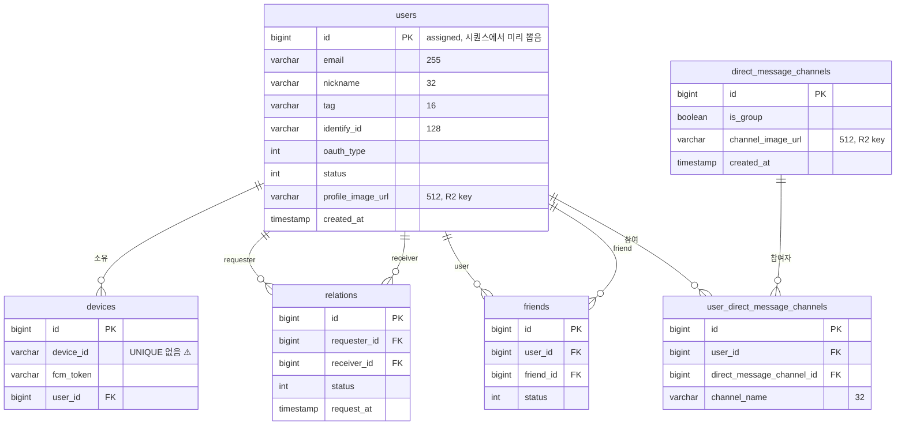
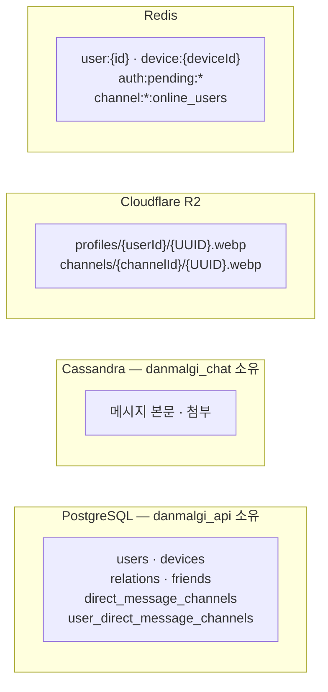

# 데이터 모델

`danmalgi_api` 가 소유한 PostgreSQL 스키마와, 데이터가 다른 저장소로 갈라지는 경계.

> 정본은 JPA 엔티티다. `ddl-auto: update` 로 운영하므로 **엔티티가 스키마를 만든다.**

---

## 1. ERD



---

## 2. 테이블별 메모

### `users`
```
UNIQUE uk_users_name_tag              (nickname, tag)
UNIQUE uk_users_oauth_type_identify_id (oauth_type, identify_id)
```

- **PK 에 `@GeneratedValue` 가 없다.** assigned id 전략이며 값은
  `nextUserId()`(시퀀스 nextval) 로 미리 확보한다 → [auth-and-identity.md](../02-domain/auth-and-identity.md#3-userid-를-미리-뽑는-이유와-그-대가)
- 시퀀스는 `pg_get_serial_sequence('users','id')` 로 찾는다. **이 시퀀스가 없으면 로그인이 실패한다**
- 시퀀스 gap 은 정상이다 (경합에서 진 id 는 버려진다)
- 필드명 ↔ 컬럼명이 어긋나는 유일한 곳: `name` → `nickname`
- `uk_users_name_tag` 는 친구 추가 기능의 전제다 (name+tag 로 사람을 찾는다)

| | 도메인 검증 | 컬럼 |
|---|---|---|
| `nickname` | 최대 16자 | `varchar(32)` |
| `tag` | 최대 5자 | `varchar(16)` |

> 상한이 두 곳에 흩어져 있다. 실제로는 도메인 검증(16/5)이 먼저 걸린다.

### `devices`
- ⚠️ **`device_id` 에 UNIQUE 제약이 없다.** `findFirstByDeviceId` 의 `First` 가 그 흔적이다.
  중복 행이 생기면 갱신되지 않는 행이 남아 죽은 FCM 토큰으로 푸시가 나간다
- ⚠️ `updateUserIdAndFcmToken` 은 이름과 달리 `user` 를 갱신하지 않는다
- `user_id` FK 때문에 **pending 유저는 디바이스를 등록할 수 없다**

### `relations` / `friends`
- **별개 테이블이다.** 요청 / 성립된 관계 → [relationship-lifecycle.md](../02-domain/relationship-lifecycle.md)
- `friends` 는 한 관계당 **2행** (A→B, B→A)
- ⚠️ 양쪽 모두 **UNIQUE 제약이 없다.** 같은 쌍이 여러 번 들어갈 수 있다
- `relations.request_at` 은 있지만 `friends` 에는 시간 컬럼이 없다

### `direct_message_channels` / `user_direct_message_channels`
```
UNIQUE (user_id, direct_message_channel_id)
```
- 방의 참여자도 이름도 DMC 에 없다. 전부 UDMC 에 있다 → [dm-channel-model.md](../02-domain/dm-channel-model.md)
- `channel_name` 은 **참여자별로 다르다** (32자 제한)
- 나가면 UDMC 행만 삭제된다. DMC 행은 남아 고아 채널이 된다

---

## 3. 인덱스 현황

`@UniqueConstraint` 로 선언된 것 외에 **명시적 인덱스가 하나도 없다.**
FK 컬럼에 자동 인덱스가 생기지 않는 PostgreSQL 특성상, 아래 조회는 전부 순차 스캔이 될 수 있다.

| 쿼리 | 대상 컬럼 |
|---|---|
| `findAllByRequesterIdAndStatus` | `relations(requester_id, status)` |
| `findAllByReceiverIdAndStatus` | `relations(receiver_id, status)` |
| `findAllByUserId` (친구) | `friends(user_id)` |
| `findAllByUserId` (채널) | `user_direct_message_channels(user_id)` |
| `findAllByDirectMessageChannelId` | `user_direct_message_channels(direct_message_channel_id)` |
| `findFirstByDeviceId` | `devices(device_id)` |
| `findAllByUser_IdIn` | `devices(user_id)` |

> 데이터가 늘기 전에 손볼 첫 항목이다.

---

## 4. `ddl-auto: update` 의 한계

자동으로 되는 것과 **안 되는 것**을 구분해야 한다.

| 변경 | 자동 반영 |
|---|---|
| 컬럼 추가 | ✅ |
| 테이블 추가 | ✅ |
| 컬럼 삭제 | ❌ (남는다) |
| 컬럼 타입·길이 축소 | ❌ |
| 제약 추가/삭제 | ❌ 사실상 기대할 수 없다 |
| 기존 데이터 정리 | ❌ |

즉 **위에서 "없다"고 적은 UNIQUE 제약과 인덱스는 엔티티에 애너테이션을 추가해도
운영 DB 에 자동으로 생기지 않는다.** 조건부 DDL 을 직접 실행해야 하고,
중복 데이터가 이미 있으면 제약 생성 자체가 실패한다.

> 선례: 레거시 `status=PENDING` 행 정리는 1회성 운영 SQL 로 처리했다.
> `danmalgi_backend/docs/legacy-pending-user-cleanup.md` 참고.

---

## 5. 저장소 경계



### 채널 id 가 두 저장소를 잇는다
`direct_message_channels.id` 가 Cassandra 의 파티션 키로 쓰인다.
**이 서버가 채널을 지우면 chat 쪽 메시지는 고아가 된다.** (현재 채널 삭제 기능은 없다)

### 이미지는 key 만 저장한다
`profile_image_url`, `channel_image_url` 컬럼에는 **R2 object key** 가 들어간다.
응답에서 URL 로 조립하는 방식이 둘이 다르다:

| | 조립 | 만료 |
|---|---|---|
| 프로필 | `toPublicUrl()` | 없음 → 캐시 가능 |
| 채널 | `generatePresignedUrl()` | 1시간 → **캐시 불가** |

`http` 로 시작하는 레거시 절대 URL 이 섞여 있을 수 있어 두 메서드 모두 그것을 우회한다.
(⚠️ 단 동작이 다르다 — `toPublicUrl` 은 원본을 반환하고 `generatePresignedUrl` 은 `""` 를 반환한다)

### 삭제되지 않는 것들
| 대상 | 상태 |
|---|---|
| 이전 프로필/채널 이미지 | R2 에 계속 쌓인다 |
| 나간 채널의 메시지 | Cassandra 에 남는다 |
| 참여자 0인 채널 | `direct_message_channels` 에 남는다 |
| `status=DELETE` 친구 | `friends` 행은 남는다 (soft delete) |
| 종료된 `relations` | `ACCEPT`/`REJECT`/`CANCEL` 상태로 남는다 |

---

## 6. Redis 키 전체

| 키 | 쓰기 주체 | TTL | 비고 |
|---|---|---|---|
| `user:{id}` | **danmalgi_api** | 2분 | chat/webrtc 가 직접 읽는 **계약** |
| `device:{deviceId}` | danmalgi_api | 10분 (기본) | `@CachePut`, `DeviceService` |
| `auth:pending:user:{userId}` | danmalgi_api | 30분 | pending 세션 본체 |
| `auth:pending:oauth:{type}:{id}` | danmalgi_api | 30분 | 계정 → userId 인덱스 |
| `channel:{id}:online_users` | danmalgi_chat | 필드 30초 | 이 서버는 읽지도 쓰지도 않는다 |
| `channel:{id}:all_users` | danmalgi_chat | 10분 | 미스 시 `device_store` 폴백 |

- 접두사는 `RedisConfig` 의 `computePrefixWith(cacheName -> cacheName + ":")` 로 정한다.
  Spring 기본값(`cacheName::key`)이 아니다 → 이걸 지우면 chat 의 캐시 히트가 0% 가 된다
- 값 직렬화는 `GenericJacksonJsonRedisSerializer` + default typing.
  그래서 `PendingOAuthProfile` 에 public 기본 생성자와 setter 가 필요하다
- 숫자는 역직렬화 시 `Integer` 로 돌아올 수 있어 `Number` 로 받는다 (`PendingAuthStore.findUserId`)

---

## 7. 함께 볼 문서

- [domain-glossary.md](domain-glossary.md) — 테이블 ↔ 도메인 용어 대응
- [dm-channel-model.md](../02-domain/dm-channel-model.md) — DMC/UDMC 분리와 advisory lock
- [auth-and-identity.md](../02-domain/auth-and-identity.md) — assigned id 와 pending 세션
