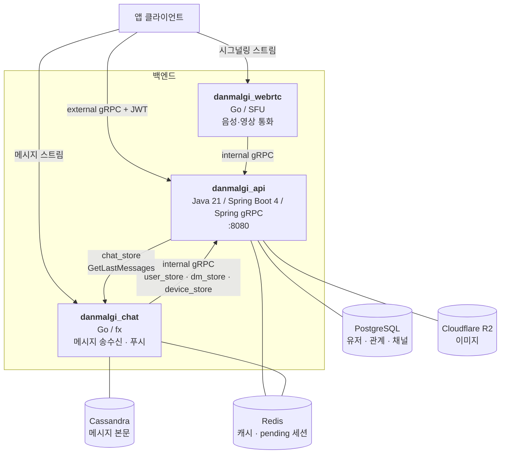
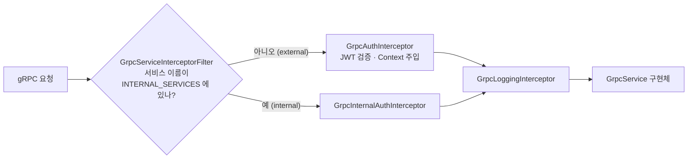

# 시스템 아키텍처

`danmalgi_api` 가 전체 시스템에서 어디에 있고, 무엇을 책임지며, 무엇을 **책임지지 않는지**.

---

## 1. 전체 구성



---

## 2. 책임 경계

| | danmalgi_api | danmalgi_chat | danmalgi_webrtc |
|---|---|---|---|
| 언어 | Java 21 / Spring | Go | Go |
| 담당 | **계정 · 관계 · 채널 메타** | **메시지 본문 · 푸시** | **통화 미디어 · 시그널링** |
| 저장소 | PostgreSQL, Redis, R2 | Cassandra, Redis, FCM | (상태 인메모리) |
| 토폴로지 | — | — | SFU (P2P 아님) |

### danmalgi_api 가 **가진** 것
- 유저 계정과 프로필, OAuth 연동, **JWT 발급**
- 친구 요청(Relation)과 친구 관계(Friendship)
- 채팅 **채널의 존재와 참여자** (`direct_message_channels`, `user_direct_message_channels`)
- 단말/FCM 토큰 등록
- 이미지 업로드(R2)

### danmalgi_api 가 **가지지 않은** 것
- **메시지 본문.** 채널 목록의 마지막 메시지조차 `chat-server` 에 물어본다
  (`chat/client/ChatMessageGrpcClient.getLastMessages`)
- **접속 여부(온라인/오프라인).** chat-server 가 클라이언트 하트비트로 판정한다
- **통화 세션 상태.** webrtc-server 소관

> 판단 기준: *"이 데이터가 없어지면 계정이 깨지나?"* → api.
> *"대화가 안 보이나?"* → chat. *"통화만 안 되나?"* → webrtc.

---

## 3. 진실의 원천 (source of truth)

| 데이터 | 원천 | 다른 서버의 접근 경로 |
|---|---|---|
| 유저 프로필 | api / PostgreSQL | `user_store.GetUsers`, 또는 Redis `user:{id}` 직접 read |
| 채널 참여자 | api / PostgreSQL | `dm_store`, `device_store.GetChannelDevices` |
| FCM 토큰 | api / PostgreSQL | `device_store.GetDevices`, Redis `device:{deviceId}` |
| 메시지 | chat / Cassandra | api 가 `chat_store.GetLastMessages` 로 조회 |

### Redis 는 캐시가 아니라 계약이다
`user:{id}` 와 `device:{deviceId}` 는 **chat/webrtc 가 직접 읽는다.** 그래서:

- 캐시에 넣기 **전에** public URL 조립을 끝낸다 (`UserService.getUser` 의 `applyPublicProfileImageUrl`).
  캐시 히트와 미스가 다른 값을 내면 다른 서버가 R2 key 를 URL 로 오인한다.
- 회원가입 직후 `@CachePut` 으로 곧바로 덮어쓴다 (`AuthService.registerUser`).
  안 그러면 TTL 2분간 chat/webrtc 가 엉뚱한 값을 본다.
- **키 이름과 값 모양을 바꾸려면 3개 리포를 같이 봐야 한다.**

---

## 4. 호출 방향 — 양쪽 모두 있다

```
앱 → api        : external/*  (유저 JWT)
chat/webrtc → api : internal/*_store  (서버 간)
api → chat        : chat_store  (서버 간, 클라이언트 측)
```

### api → chat 호출의 원칙
- **graceful degrade.** chat-server 장애가 채널 목록 조회 실패로 번지지 않는다.
  `StatusRuntimeException` 을 잡아 빈 맵을 반환한다.
- **배치 호출.** 반복문 안에서 원격 호출하지 않는다. 채널 id 전체를 한 요청으로 보낸다.
- 유저 JWT 를 그대로 전달한다 (`JwtForwardingClientInterceptor`, `GrpcContext.JWT_TOKEN`).

---

## 5. 인터셉터 배치



- 인터셉터는 **글로벌로 등록**하고, 서비스 단위 라우팅은 `GrpcServiceInterceptorFilter` 가 한다.
- allowlist 방식이라 **fail-closed** — `INTERNAL_SERVICES` 에 등록하지 않은 새 서비스는 유저 JWT 인증을 받는다.
- 인터셉터에서 던진 예외는 `GlobalGrpcExceptionHandler` 를 **타지 않는다.**
  그래서 `GrpcAuthInterceptor` 는 `serverCall.close(...)` 로 status 를 직접 닫는다.

### ⚠️ 현재 내부 호출은 인증되지 않는다
`GrpcInternalAuthInterceptor` 는 지금 **아무 검증 없이 통과**시킨다.
internal 서비스가 external 과 **같은 8080 포트**에 올라가 있으므로, 포트가 노출되면
`user_store` 등을 무인증 호출할 수 있다. 공유 시크릿 헤더 또는 mTLS peer 검증이
들어갈 자리만 잡아둔 상태이며 실제 검증은 후속 과제다.

---

## 6. 레이어 구조

```
grpc/        ← 프로토콜 경계. StreamObserver 와 proto 타입은 여기까지만
  mapper/    ← proto ↔ domain 변환
  validator/ ← 요청 필드 검증
service/     ← 비즈니스 로직, @Transactional
domain/      ← model, exception. 프레임워크 의존 없음
repository/
  entity/    ← JPA 엔티티
  persistence/ ← JpaRepository
infrastructure/ ← 외부 시스템 어댑터 (oauth, r2, redis, image)
```

- `store/` 는 이 구조의 예외다. internal proto 어댑터일 뿐이라 `grpc/` 아래만 있고
  자체 service/domain 을 두지 않는다.
- 패키지 순환을 피한다. 예: `UserEntity.registerNew` 가 `PendingOAuthProfile` 대신
  원시 타입을 받는 이유는 `user/repository` → `auth/domain` 역방향 의존을 막기 위해서다.

---

## 7. 형상 관리

- proto 는 **git submodule** 로 공유한다 (`.gitmodules`). 3개 서버가 같은 정의를 본다.
- 스키마는 `ddl-auto: update` 로 운영한다. 컬럼 추가는 자동 반영되지만
  **제약(UNIQUE)·타입 변경·데이터 정리는 수동 SQL** 이 필요하다.
- 설정 키는 `application.yaml` 참조. 값(시크릿)은 이 문서에 옮기지 않는다.
  필수 키: `jwt.secret`, `spring.datasource.*`, `spring.data.redis.*`,
  `r2.*`(`public-base-url` 은 기본값 없이 fail-fast), `spring.grpc.client.channels.chat-server.address`
