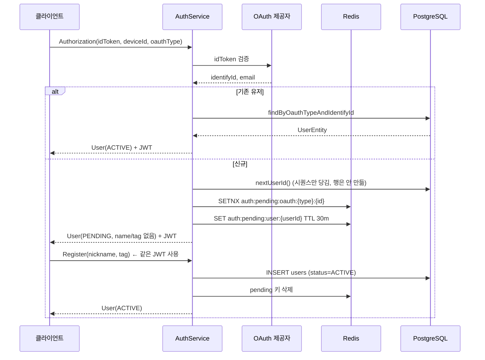

# 인증과 신원

OAuth 로그인부터 회원가입 완료까지, 그리고 그 사이의 **어중간한 상태**를 어떻게 다루는지.

---

## 1. 큰 그림 — 두 단계 가입



핵심은 **JWT 가 `Authorization` 시점에 이미 발급된다**는 것이다.
`users` 행이 없는 상태에서도 토큰이 유효하며, 그 토큰으로 회원가입을 마친다.

---

## 2. 왜 `users` 행을 미리 만들지 않는가

과거에는 `Authorization` 이 끝나면 `users` 에 `status=PENDING` 행을 먼저 INSERT 했다.
닉네임은 어댑터가 기계 생성한 값이었다. 문제:

사용자가 닉네임 입력 화면에서 이탈하면 **유령 행이 `uk_users_name_tag` 를 계속 점유**한다.
다른 사람이 그 닉네임을 정상적으로 쓰려 해도 중복으로 거부된다.

그래서 지금은 **`users` 행을 만들지 않고 Redis 에 pending 세션만** 둔다.
`users` 에 들어가는 모든 행은 처음부터 `status = ACTIVE` 다.

> 마이그레이션 메모: 레거시 `status=PENDING` 행 정리는 1회성 운영 SQL 로 처리한다.
> 절차 문서는 `danmalgi_backend/docs/legacy-pending-user-cleanup.md` 에 있다.

---

## 3. userId 를 미리 뽑는 이유와 그 대가

`UserEntity` 에는 `@GeneratedValue` 가 없다. **assigned id** 전략이다.

```
Authorization → userJpaRepository.nextUserId()  // pg 시퀀스 nextval
              → JWT 의 userId 클레임에 박아 발급
Register      → 그 id 로 INSERT
```

JWT 를 먼저 발급해야 하는데 토큰에는 userId 가 들어가야 하므로, id 를 먼저 확보할 수밖에 없다.

### 대가 1 — 동시 로그인 경합
같은 계정으로 두 번 `Authorization` 하면 각자 다른 id 를 뽑아 세션을 만들고,
**진 쪽의 토큰이 가리키는 세션이 사라진다.**

→ `PendingAuthStore.claimUserId()` 가 `SETNX` 로 승자를 하나만 남긴다.
   진 쪽은 승자의 id 를 따라간다. 버려진 id 는 **시퀀스 gap** 으로 남는다
   (PostgreSQL 시퀀스는 롤백되지 않는다 — 정상 동작이다).

### 대가 2 — TTL 내 재로그인
같은 계정이 TTL 안에 다시 로그인하면 **기존 userId 를 재사용**해야 한다.
새 id 를 뽑으면 선행 발급 토큰이 죽는다. `findUserId()` 로 먼저 조회하는 이유다.

### 대가 3 — `save()` 가 UPDATE 로 새는 문제
assigned id 라 Spring Data 가 신규 여부를 판단할 수 없어 `save()` 가 항상 `merge` 를 탄다.
merge 는 해당 id 행이 이미 있으면 INSERT 대신 **조용히 UPDATE** 한다 → 남의 유저 행 덮어쓰기.

→ `UserEntity implements Persistable<Long>` + `isNew` 플래그로 `persist` 를 강제한다.
   그래야 PK 충돌이 제약 위반으로 드러난다. `@PostPersist markNotNew()` 가 플래그를 되돌린다.

---

## 4. Pending 세션 (Redis)

`auth/infrastructure/pending/PendingAuthStore.java`

| 키 | 값 | 용도 |
|---|---|---|
| `auth:pending:user:{userId}` | `PendingOAuthProfile` | Register 가 읽는 본체 |
| `auth:pending:oauth:{oauthType}:{identifyId}` | `userId` | 계정 → userId 인덱스, 재로그인 시 id 재사용 |

- **TTL 30분.** Redis 기본 10분은 중복 태그 거부 후 재입력이나 앱 백그라운드 전환을 견디기에 짧다.
  시간 단위는 토큰 유출 시 회원가입을 완료할 수 있는 창이 너무 넓어진다.
- `save()` 는 oauth 키를 `expire` 가 아니라 `set` 으로 다시 쓴다.
  oauth 키만 먼저 만료된 어긋난 상태를 **self-heal** 하기 위해서다. 같은 계정이면 값이 같아 멱등하다.
- prefix 가 `auth:` 라 chat/webrtc 와 공유하는 `user:{id}` / `device:{deviceId}` 계약과 겹치지 않는다.

---

## 5. Pending 상태에서 할 수 있는 일

`GrpcAuthInterceptor.PENDING_ALLOWED_METHODS`

| RPC | pending 허용 | 이유 |
|---|---|---|
| `AuthService/Authorization` | 인증 자체를 건너뜀 | 토큰이 없는 진입점 |
| `AuthService/Register` | ✅ | 가입을 완료하는 RPC |
| `UserService/VerifyNameAndTag` | ✅ | 닉네임 중복 확인. 가입 화면의 일부 |
| 그 외 전부 | ❌ `FAILED_PRECONDITION` | |

특히 `UpsertFcmToken` 은 `devices.user_id` FK 때문에 **유저 행 없이는 저장 자체가 불가능**하다.
"회원가입 화면이 자기완결적으로 동작할 최소 집합"이 허용 목록의 기준이다.

### 인터셉터의 판정 순서

```
1. userService.getUser(userId)  ← @Cacheable, 대개 캐시 히트
2. 있으면 → 통과 (ACTIVE 유저, 트래픽의 사실상 전부)
3. 없으면 → pendingAuthStore.find(userId)
4.   없으면 → UNAUTHENTICATED "user not found for token"
5.   있는데 허용 목록 밖 → FAILED_PRECONDITION "registration is not completed"
```

순서가 중요하다. **ACTIVE 유저의 hot path 에 Redis GET 을 추가하지 않기 위해** DB/캐시 조회를 먼저 한다.

---

## 6. JWT

`global/security/JwtTokenProvider.java`

- 알고리즘 **HS256**, 라이브러리 nimbus-jose-jwt
- 클레임: `sub="Danmalgi"`, `userId`, `deviceId`, `iat`
- `jwt.secret` 은 **32바이트 이상**이어야 한다 (미만이면 기동/발급 시점에 `IllegalStateException`)
- `deviceId` 는 **필수 클레임**이다. 없으면 발급도 검증도 실패한다

### ⚠️ 만료가 없다
`generateToken` 에 `expirationTime` 설정이 주석 처리되어 있다. 즉 **현재 발급되는 토큰은 무기한 유효**하다.
`validateAndGetPayload` 는 `exp` 가 있으면 검사하지만, 없으면 통과시킨다(`expirationTime != null` 가드).
리프레시 토큰 체계도 없다. 만료를 도입하면 재발급 경로를 함께 설계해야 한다.

### Context 전달
검증 후 `GrpcContext` 에 심는다.

| 키 | 언제 있나 |
|---|---|
| `USER_ID` | 항상 |
| `DEVICE_ID` | 항상 |
| `JWT_TOKEN` | 항상. **chat-server 다운스트림 호출에 원본 토큰을 그대로 전달**하기 위함 |
| `USER` | `users` 행이 있을 때만 (pending 이면 없음) |

---

## 7. OAuth 제공자

`auth/infrastructure/oauth/` — `OAuthPlatformAuthorizationPort` 구현체를 `EnumMap` 으로 라우팅한다.

| `OauthType` | number | 어댑터 |
|---|---|---|
| `NAVER` | 0 | `NaverOAuthAuthorizationAdapter` |
| `GOOGLE` | 1 | `GoogleOAuthAuthorizationAdapter` |
| `KAKAO` | 2 | `KakaoOAuthAuthorizationAdapter` |

- 새 제공자는 `OauthType` 에 추가하고 포트 구현체를 빈으로 등록하면 자동 배선된다.
  같은 타입이 둘 이상이면 **기동 시점에** `IllegalStateException` 으로 막는다.
- `PendingOAuthProfile.profileImageUrl` 은 **현재 어댑터가 채우지 않는다** (항상 null).
  이 값은 R2 key 가 아니라 외부 URL 이므로 `applyPublicProfileImageUrl` 대상이 아니다.

---

## 8. UserStatus

| 값 | number | 현재 쓰임 |
|---|---|---|
| `PENDING` | 0 | **더 이상 생성되지 않는다.** 레거시 행에만 남아 있음 |
| `ACTIVE` | 1 | `registerNew` 가 지정하는 유일한 값 |
| `BLOCKED` | 2 | 전환 코드 **없음** |
| `WITHDRAWAL` | 3 | 전환 코드 **없음** |

> 즉 지금 코드에서 새로 만들어지는 모든 유저는 `ACTIVE` 다.
> 조회 경로(`verifyNameAndTag`, `findByNameAndTag`, `GetUsers`)에 status 필터가 없는 것은
> 이 전제에 기대고 있다. **탈퇴/정지를 구현하면 그 필터들을 함께 추가해야 한다.**

---

## 9. Register 의 멱등성

응답이 유실된 뒤의 재시도는 현실적인 시나리오다. `registerUser` 는:

- pending 세션이 **없고** `users` 행이 **있으면** → 기존 유저를 그대로 반환 (멱등 성공)
- pending 세션도 `users` 행도 없으면 → `PendingRegistrationNotFoundException`
- ⚠️ 단, **다른 닉네임으로 재호출해도 개명되지 않는다.** 개명은 별도 RPC 소관

### `saveAndFlush` 인 이유
INSERT 를 메서드 안에서 터뜨려야 `uk_users_name_tag` 경합이 **pending 세션 삭제보다 먼저** 드러난다.
커밋 시점 flush 면 세션을 이미 지운 뒤 실패해서 사용자의 토큰이 죽는다.

### `@CachePut` 인 이유
반환값을 곧바로 `user:{id}` 에 덮어쓴다. 여기서 public URL 까지 조립해두지 않으면
회원가입 직후 TTL 2분간 chat/webrtc 가 raw R2 key 를 본다.

---

## 10. 함께 볼 문서

- [domain-glossary.md](../01-foundation/domain-glossary.md) — User / PendingOAuthProfile / Device
- [system-architecture.md](../01-foundation/system-architecture.md) — 인터셉터 배치, Redis 공유 계약
