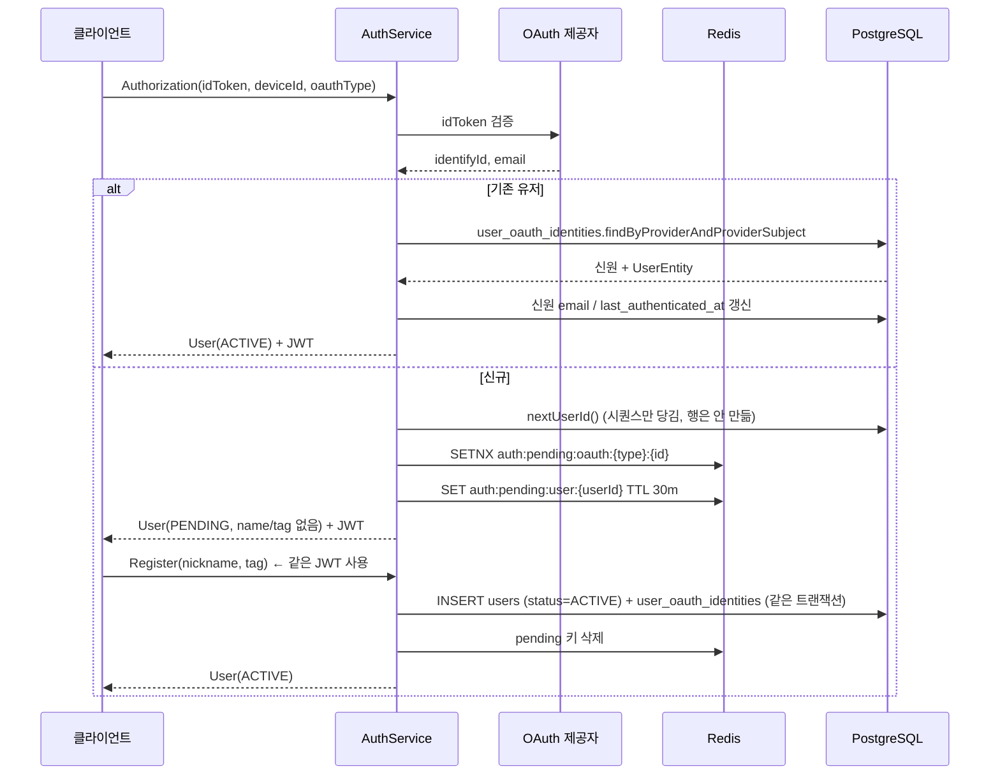

# 인증과 신원

OAuth 로그인부터 회원가입 완료까지, 그리고 그 사이의 **어중간한 상태**를 어떻게 다루는지.

---

## 1. 큰 그림 — 두 단계 가입


```mermaid
sequenceDiagram
    participant C as 클라이언트
    participant A as AuthService
    participant O as OAuth 제공자
    participant R as Redis
    participant D as PostgreSQL

    C->>A: Authorization(idToken, deviceId, oauthType)
    A->>O: idToken 검증
    O-->>A: identifyId, email

    alt 기존 유저
        A->>D: user_oauth_identities.findByProviderAndProviderSubject
        D-->>A: 신원 + UserEntity
        A->>D: 신원 email / last_authenticated_at 갱신
        A-->>C: User(ACTIVE) + JWT
    else 신규
        A->>D: nextUserId()  (시퀀스만 당김, 행은 안 만듦)
        A->>R: SETNX auth:pending:oauth:{type}:{id}
        A->>R: SET auth:pending:user:{userId}  TTL 30m
        A-->>C: User(PENDING, name/tag 없음) + JWT
        C->>A: Register(nickname, tag)   ← 같은 JWT 사용
        A->>D: INSERT users (status=ACTIVE) + user_oauth_identities (같은 트랜잭션)
        A->>R: pending 키 삭제
        A-->>C: User(ACTIVE)
    end
```

핵심은 **JWT 가 `Authorization` 시점에 이미 발급된다**는 것이다.
`users` 행이 없는 상태에서도 토큰이 유효하며, 그 토큰으로 회원가입을 마친다.

---

## 2. 왜 `users` 행을 미리 만들지 않는가

과거에는 `Authorization` 이 끝나면 `users` 에 `status=PENDING` 행을 먼저 INSERT 했다.
닉네임은 어댑터가 기계 생성한 값이었다. 문제:

사용자가 닉네임 입력 화면에서 이탈하면 **유령 행이 `uk_users_name_tag` 를 계속 점유**한다.
다른 사람이 그 닉네임을 정상적으로 쓰려 해도 중복으로 거부된다.

그래서 지금은 **`users` 행을 만들지 않고 Redis 에 pending 세션만** 둔다.
`users` 에 들어가는 모든 행은 처음부터 `status = ACTIVE` 다.

> 마이그레이션 메모: 레거시 `status=PENDING` 행 정리는 1회성 운영 SQL 로 처리한다.
> 절차 문서는 `danmalgi_backend/docs/legacy-pending-user-cleanup.md` 에 있다.

---

## 3. userId 를 미리 뽑는 이유와 그 대가

`UserEntity` 에는 `@GeneratedValue` 가 없다. **assigned id** 전략이다.

```
Authorization → userJpaRepository.nextUserId()  // pg 시퀀스 nextval
              → JWT 의 userId 클레임에 박아 발급
Register      → 그 id 로 INSERT
```

JWT 를 먼저 발급해야 하는데 토큰에는 userId 가 들어가야 하므로, id 를 먼저 확보할 수밖에 없다.

### 대가 1 — 동시 로그인 경합
같은 계정으로 두 번 `Authorization` 하면 각자 다른 id 를 뽑아 세션을 만들고,
**진 쪽의 토큰이 가리키는 세션이 사라진다.**

→ `PendingAuthStore.claimUserId()` 가 `SETNX` 로 승자를 하나만 남긴다.
   진 쪽은 승자의 id 를 따라간다. 버려진 id 는 **시퀀스 gap** 으로 남는다
   (PostgreSQL 시퀀스는 롤백되지 않는다 — 정상 동작이다).

### 대가 2 — TTL 내 재로그인
같은 계정이 TTL 안에 다시 로그인하면 **기존 userId 를 재사용**해야 한다.
새 id 를 뽑으면 선행 발급 토큰이 죽는다. `findUserId()` 로 먼저 조회하는 이유다.

### 대가 3 — `save()` 가 UPDATE 로 새는 문제
assigned id 라 Spring Data 가 신규 여부를 판단할 수 없어 `save()` 가 항상 `merge` 를 탄다.
merge 는 해당 id 행이 이미 있으면 INSERT 대신 **조용히 UPDATE** 한다 → 남의 유저 행 덮어쓰기.

→ `UserEntity implements Persistable<Long>` + `isNew` 플래그로 `persist` 를 강제한다.
   그래야 PK 충돌이 제약 위반으로 드러난다. `@PostPersist markNotNew()` 가 플래그를 되돌린다.

---

## 4. Pending 세션 (Redis)

`auth/infrastructure/pending/PendingAuthStore.java`

| 키 | 값 | 용도 |
|---|---|---|
| `auth:pending:user:{userId}` | `PendingOAuthProfile` | Register 가 읽는 본체 |
| `auth:pending:oauth:{oauthType 이름}:{identifyId}` | `userId` | 계정 → userId 인덱스, 재로그인 시 id 재사용 |

- **TTL 30분.** Redis 기본 10분은 중복 태그 거부 후 재입력이나 앱 백그라운드 전환을 견디기에 짧다.
  시간 단위는 토큰 유출 시 회원가입을 완료할 수 있는 창이 너무 넓어진다.
- `save()` 는 oauth 키를 `expire` 가 아니라 `set` 으로 다시 쓴다.
  oauth 키만 먼저 만료된 어긋난 상태를 **self-heal** 하기 위해서다. 같은 계정이면 값이 같아 멱등하다.
- Apple 신규 유저는 `encryptedRefreshToken` 과 `oauthClientId` 를 함께 담는다. 평문이 아니라
  `CredentialCipher` 암호문이라 Redis 덤프로 토큰이 새지 않는다.
- prefix 가 `auth:` 라 chat/webrtc 와 공유하는 `user:{id}` / `device:{deviceId}` 계약과 겹치지 않는다.

같은 Redis 에 pending 이 아닌 auth 키가 하나 더 있다 (`auth/infrastructure/replay/OAuthNonceReplayStore.java`).

| 키 | 값 | 용도 |
|---|---|---|
| `auth:oauth:used-nonce:{oauthType 이름}:{nonce 클레임}` | `true` | 검증을 통과한 Apple nonce 의 1회 소비 (§7). TTL 은 토큰 `exp` + 60초 |

---

## 5. Pending 상태에서 할 수 있는 일

`GrpcAuthInterceptor.PENDING_ALLOWED_METHODS`

| RPC | pending 허용 | 이유 |
|---|---|---|
| `AuthService/Authorization` | 인증 자체를 건너뜀 | 토큰이 없는 진입점 |
| `AuthService/Register` | ✅ | 가입을 완료하는 RPC |
| `UserService/VerifyNameAndTag` | ✅ | 닉네임 중복 확인. 가입 화면의 일부 |
| 그 외 전부 | ❌ `FAILED_PRECONDITION` | |

특히 `UpsertFcmToken` 은 `devices.user_id` FK 때문에 **유저 행 없이는 저장 자체가 불가능**하다.
"회원가입 화면이 자기완결적으로 동작할 최소 집합"이 허용 목록의 기준이다.

### 인터셉터의 판정 순서

```
1. userService.getUser(userId)  ← @Cacheable, 대개 캐시 히트
2. 있으면 → 통과 (ACTIVE 유저, 트래픽의 사실상 전부)
3. 없으면 → pendingAuthStore.find(userId)
4.   없으면 → UNAUTHENTICATED "user not found for token"
5.   있는데 허용 목록 밖 → FAILED_PRECONDITION "registration is not completed"
```

순서가 중요하다. **ACTIVE 유저의 hot path 에 Redis GET 을 추가하지 않기 위해** DB/캐시 조회를 먼저 한다.

---

## 6. JWT

`global/security/JwtTokenProvider.java`

- 알고리즘 **HS256**, 라이브러리 nimbus-jose-jwt
- 클레임: `sub="Danmalgi"`, `userId`, `deviceId`, `iat`
- `jwt.secret` 은 **32바이트 이상**이어야 한다 (미만이면 기동/발급 시점에 `IllegalStateException`)
- `deviceId` 는 **필수 클레임**이다. 없으면 발급도 검증도 실패한다

### ⚠️ 만료가 없다
`generateToken` 에 `expirationTime` 설정이 주석 처리되어 있다. 즉 **현재 발급되는 토큰은 무기한 유효**하다.
`validateAndGetPayload` 는 `exp` 가 있으면 검사하지만, 없으면 통과시킨다(`expirationTime != null` 가드).
리프레시 토큰 체계도 없다. 만료를 도입하면 재발급 경로를 함께 설계해야 한다.

### Context 전달
검증 후 `GrpcContext` 에 심는다.

| 키 | 언제 있나 |
|---|---|
| `USER_ID` | 항상 |
| `DEVICE_ID` | 항상 |
| `JWT_TOKEN` | 항상. **chat-server 다운스트림 호출에 원본 토큰을 그대로 전달**하기 위함 |
| `USER` | `users` 행이 있을 때만 (pending 이면 없음) |

---

## 7. OAuth 제공자

`auth/infrastructure/oauth/` — `OAuthPlatformAuthorizationPort` 구현체를 `EnumMap` 으로 라우팅한다.

| `OauthType` | 어댑터 |
|---|---|
| `GOOGLE` | `GoogleOAuthAuthorizationAdapter` |
| `APPLE` | `AppleOAuthAuthorizationAdapter` |

- 도메인 `OauthType` 에는 번호가 없다. DB(`user_oauth_identities.provider`)와 pending 키에는 **이름**으로
  저장되고, proto 와는 `AuthGrpcMapper.toDomainOauthType` 의 switch 로 변환한다. 상수 이름을 바꾸면 기존 행이 깨진다.
- 계정은 `users` 가 아니라 **OAuth 신원**(`user_oauth_identities`)으로 찾는다. 로그인할 때마다 신원의
  `email` 과 `last_authenticated_at` 을 갱신하지만 `users.email`(대표 이메일)은 바꾸지 않는다.
  연동이 생기면 대표 이메일을 고르는 규칙이 따로 필요하기 때문이다.
- `User`(proto, 캐시, `user_store`)에는 OAuth 제공자가 **실리지 않는다.** 한 유저가 여러 제공자를 가질 수 있어서다.
  proto `User.oauth_type = 5` 는 `reserved` 다.
- **빈틈**: 연동/해제 RPC 는 없다. `uk_user_oauth_identities_user_provider` 는 그때를 위한 제약이다.
- 포트는 idToken 하나가 아니라 `OAuthCredential` 을 받는다. 제공자마다 쓰는 값이 달라서
  쓰지 않는 값은 어댑터가 무시한다 (Google 은 `rawNonce` 를 읽지 않는다).
- **Apple idToken 검증** (`AppleIdTokenVerifier`). 로그인 idToken 과 code 교환 응답의 id_token 이
  같은 규칙·같은 JWKS 캐시를 쓴다.

  | 항목 | 규칙 | 이유 |
  |---|---|---|
  | 서명 | RS256 만. kid 로 Apple JWKS 에서 키 선택 | none / HS256(alg 혼동) 차단 |
  | `iss` | `https://appleid.apple.com` | |
  | `aud` | **정확히 1개**이고 허용 목록 안. 로그인은 `oauth.apple.audiences`, 교환은 요청한 `client_id` 하나 | aud 가 여럿이면 허용 밖 값이 `client_id` 로 흘러갔다 |
  | `exp` | **필수**, clock skew 60초 | Spring 기본은 exp 가 없어도 통과시킨다 |
  | `iat` | **필수**, 미래(skew 초과) 거절, `exp > iat` | |
  | JWKS | 5분 캐시. 모르는 kid 면 재조회하되 **30초 창에 최대 2회** | 임의 kid 토큰 연사로 Apple 호출과 refresh lock 대기가 무한히 생기던 것 차단 |

  - iat 의 "최대 나이"는 두지 않는다. Apple 토큰 수명(exp − iat)을 공식 문서로 확인하지 못했고,
    짧게 잡으면 정상 로그인이 깨진다. 오래된 토큰은 exp 와 nonce 1회 소비로 막는다.
  - rate limit 에 걸린 모르는 kid 는 `UNAUTHENTICATED` 로 본다 (위조 토큰). trade-off: Apple 이 키를
    교체한 직후 새 kid 토큰이 **최대 30초** 거절될 수 있다.
  - JWKS 조회 실패는 `OauthProviderUnavailableException`(`UNAVAILABLE`)이다. 토큰이 틀린 게 아니므로
    클라이언트가 재로그인이 아니라 재시도하게 한다.
  - `email_verified` / `is_private_email` 은 읽지 않는다 (문자열 `"true"` 와 boolean 이 섞여 온다).
    email 은 식별에 쓰지 않기 때문이다. **email 을 연동·식별에 쓰게 되면 그때 `email_verified` 를 검사해야 한다.**
  - email 은 기존 유저도 필수다 (`users.email` 이 NOT NULL).
- **Apple nonce**: 앱이 `raw_nonce` 를 만들고 Apple 에는 `sha256(raw_nonce)` 의 소문자 hex 를,
  서버에는 원문을 보낸다. 어댑터가 `hex(sha256(raw_nonce)) == nonce 클레임` 을 상수시간 비교하고
  다르면 `UNAUTHENTICATED` 다. 통과한 nonce 는 Redis 에 **1회용으로 소비**한다 (§4). 같은 쌍을 다시 보내면
  `UNAUTHENTICATED` 다. 기존 유저는 code 교환 없이도 로그인되고 우리 JWT 는 만료가 없어서(§6),
  재사용을 막지 않으면 한 번 새어 나간 (idToken, raw_nonce) 쌍이 영구 세션이 된다.
  - 소비는 어댑터의 다른 검사가 모두 끝난 뒤에 한다. 다른 이유로 거절될 토큰 때문에 nonce 를 태우지 않는다.
  - 그 대신 **서비스 단계(code 교환 등)에서 실패한 요청을 같은 idToken 으로 재시도하면 거절된다.**
    `UNAVAILABLE` 을 받은 Apple 로그인은 Apple 인증부터 다시 해야 한다.
  - `raw_nonce` 없이 **nonce 클레임이 있는** 토큰은 거절한다. 새 앱 토큰에서 `raw_nonce` 만 빼고 보내
    검증을 건너뛰는 다운그레이드를 막는다.
  - `nonce_supported` 클레임은 보지 않는다. `raw_nonce` 가 있는데 클레임이 없으면 무조건 거절하므로
    Apple 권고보다 엄격한 쪽이다.
  - **미완성**: 구 앱 토큰(클레임도 `raw_nonce` 도 없음)은 `oauth.apple.nonce-required=false` 동안 통과하고,
    **재사용을 막지 못한다.** info 로그(`accepted without nonce`)로 비율을 보고 구 앱이 빠지면 플래그를 켠다.
  - APPLE 일 때 필수 검사를 validator 에 두지 않는다. 구 앱의 Google 요청(wire 1)이 APPLE 로
    해석되는데, validator 에서 막으면 `UNAUTHENTICATED` 대신 `INVALID_ARGUMENT` 가 나가서
    클라이언트 대응이 달라진다. validator 는 길이 상한(raw_nonce 256자, idToken 8192자, code 1024자)만 본다.
- 새 제공자는 `OauthType` 에 추가하고 포트 구현체를 빈으로 등록하면 자동 배선된다.
  같은 타입이 둘 이상이면 **기동 시점에** `IllegalStateException` 으로 막는다.
- `PendingOAuthProfile.profileImageUrl` 은 **현재 어댑터가 채우지 않는다** (항상 null).
  이 값은 R2 key 가 아니라 외부 URL 이므로 `applyPublicProfileImageUrl` 대상이 아니다.

### Apple authorization code 교환

계정 삭제 시 Apple revoke 를 하려면 refresh token 이 있어야 하고, 그 토큰은 로그인 때 받은
`authorization_code` 를 교환해야만 얻는다. code 는 **5분 안에 한 번만** 쓸 수 있어 Register 로
미룰 수 없으므로 Authorization 에서 교환한다.

- 교환은 `OAuthAuthorizationCodeExchangePort` 로 id_token 검증과 분리했다. 실패했을 때 막을지가
  기존 유저인지에 달려 있고, 그 판단은 DB 를 보는 `AuthService` 가 한다. 구현체가 없는 Google 은 교환하지 않는다.
- `client_id` 는 검증된 idToken 의 `aud` 다 (`PendingOAuthProfile.oauthClientId`). code 를 발급받은
  클라이언트와 같아야 하므로 iOS 는 Bundle ID, Android 는 Services ID 가 된다.
  Services ID 로 받은 code 는 `redirect_uri` 를 함께 보내야 교환된다.
- `client_secret` 은 요청마다 5분짜리 ES256 JWT 를 새로 만든다 (`AppleClientSecretGenerator`).
- **응답 id_token 을 검증하고 그 `sub` 가 로그인 idToken 의 `sub` 와 같은지 확인한다.** idToken 과 code 는
  클라이언트가 따로 보내므로, 계정 A 의 idToken 에 계정 B 의 code 를 섞으면 B 의 refresh token 이 A 에
  저장되고 탈퇴 때 엉뚱한 토큰을 revoke 하게 된다. 응답 id_token 의 aud 는 요청한 `client_id` 하나만 허용한다.

| 상황 | 결과 |
|---|---|
| 신규 유저, 교환 성공 | 암호문을 pending 프로필에 담고 Register 에서 `users`·신원과 같은 트랜잭션으로 저장 |
| 신규 유저, 교환 실패 또는 code 없음 | **로그인 실패.** 토큰 없이 가입하면 revoke 할 수 없다. userId 를 뽑기 전에 막는다 |
| 기존 유저, 교환 성공 | `user_apple_credentials` 를 신원 id 기준으로 upsert |
| 기존 유저, 교환 실패 또는 code 없음 | 경고 로그만 남기고 **로그인 허용.** 저장된 토큰이 없어도(PoC 계정 등) 허용하고, 다음 성공 때 채워진다. idToken 만으로 로그인되는 경로라 nonce 1회 소비가 전제다 |
| 신규·기존 모두, code 가 다른 계정의 것 (`SUBJECT_MISMATCH`) | **로그인 실패** (`UNAUTHENTICATED`). 정상 앱에서는 생길 수 없다 |

실패 status 는 `AuthorizationCodeExchangeException.Reason` 이 정한다 → [error-catalog.md](../04-conventions/error-catalog.md).

**빈틈**
- TTL 안에 다시 로그인하면 새 refresh token 이 pending 을 덮어쓴다. 이전 토큰은 Apple 쪽에서
  revoke 되지 않은 채 남는다 (이슈 #3 의 3-4 에서 다룬다).
- 기존 유저가 교환에 계속 실패하면 저장된 토큰이 오래된 채로 남는다. 주기적 유효성 검사는 범위 밖이다.

---

## 8. UserStatus

| 값 | number | 현재 쓰임 |
|---|---|---|
| `PENDING` | 0 | **더 이상 생성되지 않는다.** 레거시 행에만 남아 있음 |
| `ACTIVE` | 1 | `registerNew` 가 지정하는 유일한 값 |
| `BLOCKED` | 2 | 전환 코드 **없음** |
| `WITHDRAWAL` | 3 | 전환 코드 **없음** |

> 즉 지금 코드에서 새로 만들어지는 모든 유저는 `ACTIVE` 다.
> 조회 경로(`verifyNameAndTag`, `findByNameAndTag`, `GetUsers`)에 status 필터가 없는 것은
> 이 전제에 기대고 있다. **탈퇴/정지를 구현하면 그 필터들을 함께 추가해야 한다.**

---

## 9. Register 의 멱등성

응답이 유실된 뒤의 재시도는 현실적인 시나리오다. `registerUser` 는:

- pending 세션이 **없고** `users` 행이 **있으면** → 기존 유저를 그대로 반환 (멱등 성공)
- pending 세션도 `users` 행도 없으면 → `PendingRegistrationNotFoundException`
- ⚠️ 단, **다른 닉네임으로 재호출해도 개명되지 않는다.** 개명은 별도 RPC 소관

### `saveAndFlush` 인 이유
INSERT 를 메서드 안에서 터뜨려야 `uk_users_name_tag` 경합이 **pending 세션 삭제보다 먼저** 드러난다.
커밋 시점 flush 면 세션을 이미 지운 뒤 실패해서 사용자의 토큰이 죽는다.

### `@CachePut` 인 이유
반환값을 곧바로 `user:{id}` 에 덮어쓴다. 여기서 public URL 까지 조립해두지 않으면
회원가입 직후 TTL 2분간 chat/webrtc 가 raw R2 key 를 본다.

---

## 10. 함께 볼 문서

- [domain-glossary.md](../01-foundation/domain-glossary.md) — User / PendingOAuthProfile / Device
- [system-architecture.md](../01-foundation/system-architecture.md) — 인터셉터 배치, Redis 공유 계약
