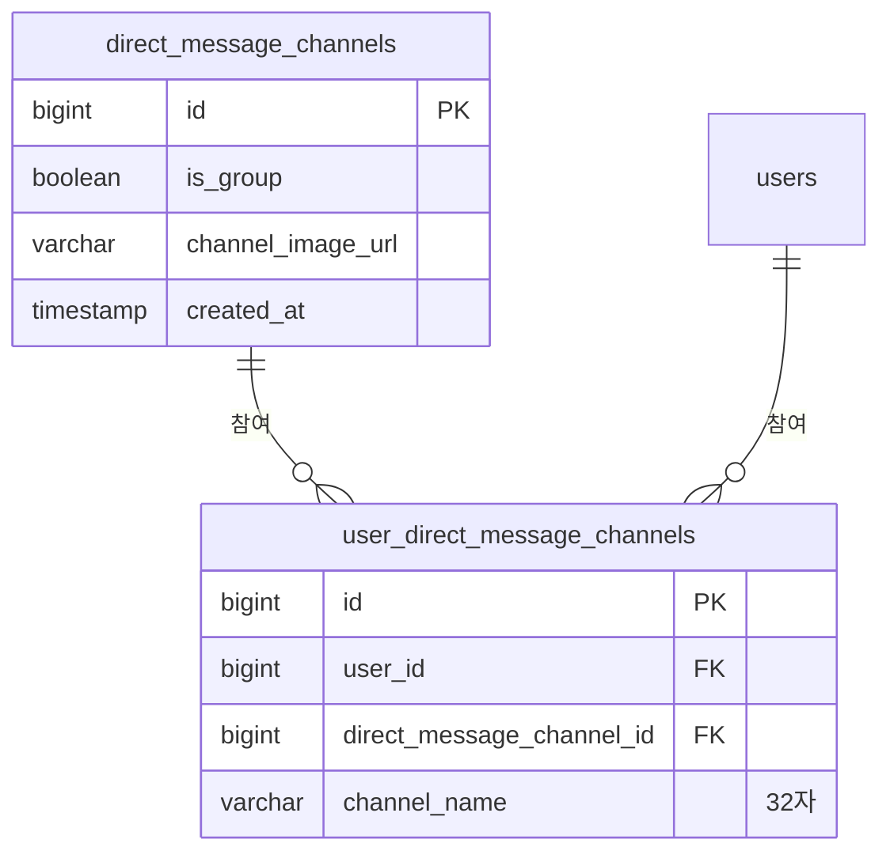
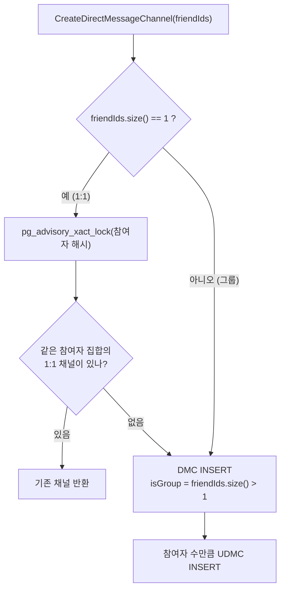

# DM 채널 모델

채팅방은 **두 테이블로 쪼개져 있다.** 왜 그런지, 그리고 1:1 방 중복 생성을 어떻게 막는지.

---

## 1. 왜 두 테이블인가



| | DMC (`direct_message_channels`) | UDMC (`user_direct_message_channels`) |
|---|---|---|
| 뜻 | **방 그 자체** | **참여 + 그 사람에게 보이는 방 이름** |
| 공유 | 모든 참여자가 같은 값을 본다 | 사람마다 다르다 |
| 가진 것 | `isGroup`, `channelImageUrl` | `channelName` |

### 채널 이름이 UDMC 에 있는 이유
1:1 방의 이름은 **"상대방 이름"** 이다. A 에게는 "B", B 에게는 "A" 로 보여야 한다.
방 하나에 이름 하나를 두면 이걸 표현할 수 없다.

```java
// UserDirectMessageChannelService.buildChannelName
allParticipants.stream()
    .filter(other -> !other.getId().equals(participant.getId()))  // 나를 뺀다
    .map(UserEntity::getName)
    .collect(Collectors.joining(","));
```

- 참여자별로 **자기를 제외한** 이름을 `,` 로 이어 붙인다
- 그룹방도 같은 규칙이다. 참여자가 많으면 `channel_name` **32자 제한에 걸려 INSERT 가 실패**할 수 있다
- 생성 시점의 스냅샷이다. **이후 참여자가 개명해도 갱신되지 않는다**

### 그룹방 이름 변경은 전원에게 적용된다
`updateChannelName` 은 해당 채널의 **모든 UDMC 행**을 같은 값으로 덮어쓴다.
즉 그룹방에서 이름을 바꾸면 개인화가 사라지고 전원이 같은 이름을 본다.
(1:1 방은 `updateChannel` 이 `NotGroupChannelException` 으로 막는다)

---

## 2. 채널 생성



### 1:1 만 중복 제거한다
```java
// 같은 멤버로 주제별 그룹방을 여러 개 만드는 것은 정상 시나리오다.
if (friendIds.size() == 1) { ... }
```
그룹방은 같은 멤버 조합이라도 여러 개 만들 수 있다. 의도된 동작이다.

### ⚠️ 친구 여부를 확인하지 않는다
`createChannel` 은 `friendIds` 가 실제로 친구인지, 나를 차단했는지 **보지 않는다.**
임의의 userId 로 채널을 만들 수 있다. → [relationship-lifecycle.md](relationship-lifecycle.md#8-알려진-빈틈-정리)

---

## 3. 1:1 중복 방지 — advisory lock

동시에 두 요청이 들어오면 "조회 → 없음 → 생성"이 둘 다 통과해 **같은 쌍의 방이 2개** 생긴다.
UNIQUE 제약으로는 막을 수 없다 — 중복의 정의가 "참여자 집합이 같다"는 **여러 행에 걸친 조건**이기 때문이다.

그래서 PostgreSQL **transaction advisory lock** 으로 직렬화한다.

```java
@Transactional
public Optional<Long> lockAndFindOneToOneChannelId(List<Long> participantIds) {
    udmcJpaRepository.acquireChannelParticipantsLock(ParticipantsLockKey.of(participantIds));
    return udmcJpaRepository.findChannelIdsByExactParticipants(...);
}
```

### 반드시 지켜야 할 두 가지
1. **락을 먼저 잡고 조회한다.** 순서가 바뀌면 아무것도 막지 못한다.
2. **채널 생성과 같은 트랜잭션 안에서 호출한다.** `pg_advisory_xact_lock` 은
   트랜잭션 종료 시 해제된다. `REQUIRES_NEW` 로 분리하면 락이 즉시 풀려 무의미해진다.

### 락 키 만들기
`ParticipantsLockKey.of()` — 참여자 id 를 **오름차순 정렬 후 FNV-1a 64bit 해시**.

- 정렬하므로 `[1,2]` 와 `[2,1]` 이 같은 키가 된다
- `String.hashCode()` 는 32bit 라 bigint 키 공간을 절반 이하로 낭비해서 쓰지 않는다
- **해시 충돌은 무해하다.** 무관한 조합의 채널 생성이 불필요하게 직렬화될 뿐이다

### 조회 쿼리의 세 조건
```sql
WHERE u.user.id IN :participantIds
  AND c.isGroup = false
  AND NOT EXISTS (... x.user.id NOT IN :participantIds)
GROUP BY c.id
HAVING COUNT(u.id) = :participantCount
ORDER BY c.id ASC
```

| 조건 | 없으면 |
|---|---|
| `HAVING COUNT` | 요청 참여자 중 일부만 있는 방에도 매칭 |
| `NOT EXISTS` | **3인 방이 2인 조건에 오매칭** |
| `isGroup = false` | 그룹방에서 한 명이 나가 2행이 되면 1:1 조건에 걸린다 — **성능 조건이 아니라 정확성 요건** |
| `ORDER BY` | 기존 중복 데이터가 있을 때 호출마다 다른 방을 고른다 |

---

## 4. 나가기

```java
@Transactional
public void leaveChannel(Long userId, Long channelId) {
    udmcJpaRepository.delete(getUserChannel(userId, channelId));
}
```

- **UDMC 행 하나만 지운다.** DMC 행은 남는다
- **마지막 한 명이 나가도 방은 남는다.** 참여자 0인 고아 채널이 생긴다
- 메시지·이미지 정리는 하지 않는다 (chat-server / R2 에 그대로 남는다)
- 1:1 방에서 한 명이 나가면 남은 사람의 목록에는 **참여자 1명짜리 방**으로 보인다

> 정리 배치는 없다. 고아 채널·잔여 메시지 회수는 미해결 과제다.

### 나간 뒤 재생성하면?
1:1 에서 A 가 나가면 UDMC 는 1행만 남는다. 이후 A 가 B 와 다시 방을 만들면
`HAVING COUNT = 2` 를 만족하지 못하므로 **새 채널이 생긴다.** 이전 대화와 이어지지 않는다.

---

## 5. 채널 이미지

| | 프로필 이미지 | 채널 이미지 |
|---|---|---|
| R2 key | `profiles/{userId}/{UUID}.webp` | `channels/{channelId}/{UUID}.webp` |
| 응답 URL | `toPublicUrl()` — **만료 없음** | `generatePresignedUrl()` — **1시간 만료** |
| 캐시 가능 | ✅ Redis `user:{id}` 에 담긴다 | ❌ **담으면 안 된다** |

> 이 비대칭을 놓치기 쉽다. 채널 이미지 URL 을 캐시하거나 클라이언트에 오래 보관하면
> 만료 후 깨진다. 매 응답마다 새로 서명한다.

- 업로드는 항상 **webp 변환**을 거친다 (`ImageProcessor`, 긴 변 512px, 품질 80)
- 잘못된 이미지는 `InvalidImageException` → `INVALID_ARGUMENT`
- key 에 UUID 가 들어가 매번 새 경로가 된다. 그래서 `Cache-Control: immutable` 을 붙인다
- **이전 오브젝트는 삭제하지 않는다.** 업로드할수록 R2 에 쌓인다

---

## 6. 채널 목록 조회

`GetDirectMessageChannelList` 는 마지막 메시지를 함께 준다.
메시지는 이 서버에 없으므로 chat-server 에 배치 조회한다.

```java
List<Long> channelIds = channels.stream().map(DirectMessage::getId).toList();
Map<Long, LastMessage> lastMessages = chatMessageClient.getLastMessages(channelIds);
```

- **반복문 안에서 원격 호출하지 않는다.** 채널 수와 무관하게 정확히 1콜
- chat-server 실패는 예외가 아니라 **빈 맵으로 degrade** — 목록은 뜨고 마지막 메시지만 빈다
- 자세한 것은 [messaging-flow.md](../03-integration/messaging-flow.md)

### 목록 순서

`DirectMessageService.getDirectMessageChannels` 가 `lastMessage` 를 채운 **뒤**에 정렬한다.
DB `ORDER BY` 로 못 푸는 이유: last message 는 chat-server 소유라, 위 배치 조회로
채워지기 전에는 정렬 키 자체가 없다.

1. `lastMessage.createdAt` 내림차순 (최신 대화가 위)
2. `lastMessage` 가 없는 채널(메시지 0건, 또는 chat-server 가 `created_at` 을 안 준
   방어적 예외 케이스)은 **항상 뒤로** — 방금 만든 빈 방이 대화 중인 방을 밀어내지
   않게 하기 위해서다. 코드만 봐서는 이 이유가 안 보인다
3. 위 두 기준이 같으면(동률, 또는 둘 다 순서 없음 그룹) `dm_id` 내림차순으로 고정 —
   같은 입력엔 항상 같은 순서가 나오게

chat-server 장애로 배치 조회 전체가 빈 맵으로 degrade 되면, 그 순간엔 모든 채널이
"순서 없음" 그룹이 되어 목록이 `dm_id` 내림차순으로 보인다. 순서가 평소와 달라 보이지만
결정적이다 — 장애가 끝나면 다시 최신순으로 돌아온다.

페이지네이션이 없어 매 요청 전량 정렬이다. N+1(아래)과 같은 지점에서 채널 수가
늘어날수록 비용이 커진다.

### N+1 주의
`toDirectMessage()` 가 채널마다 `findAllByDirectMessageChannelId` 로 참여자를 조회한다.
**채널 수만큼 쿼리가 나간다.** 채널이 많은 사용자에서 비용이 커지는 지점이다.

---

## 7. 알려진 빈틈

| 항목 | 현재 상태 |
|---|---|
| 친구 여부 검증 | **없음** — 아무 userId 로나 방 생성 가능 |
| `friendIds` 빈 값·중복·자기 자신 포함 | **검증됨** (`DirectMessageGrpcValidator`) |
| 참여자 인원 상한 | **없음** — `channel_name` 32자 제한에 먼저 걸린다 |
| `friendIds` 가 실재하는 유저인지 | **없음** — `getReferenceById` 라 FK 위반으로 뒤늦게 터진다 |
| 고아 채널 정리 | **없음** |
| 나간 뒤 메시지·이미지 정리 | **없음** |
| 채널 이름 개명 반영 | **없음** — 생성 시점 스냅샷 |
| 참여자 조회 N+1 | 있음 |

---

## 8. 함께 볼 문서

- [domain-glossary.md](../01-foundation/domain-glossary.md) — DMC / UDMC
- [messaging-flow.md](../03-integration/messaging-flow.md) — 마지막 메시지와 푸시
- [data-model.md](../01-foundation/data-model.md) — 테이블 정의
