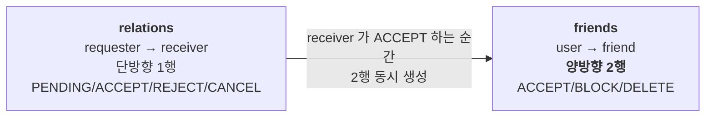
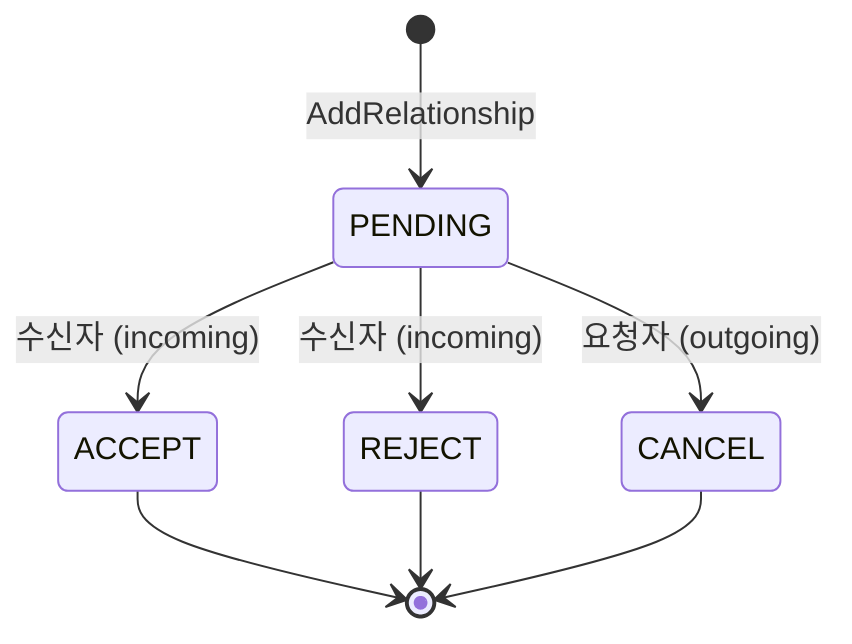
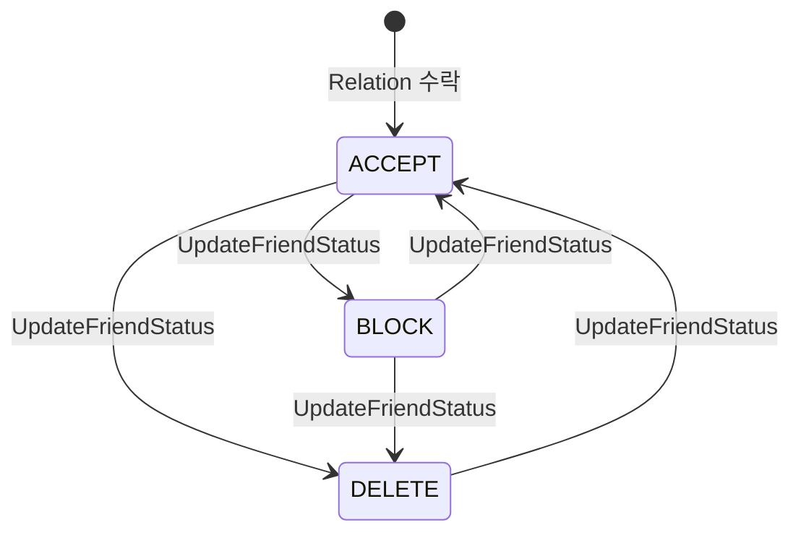
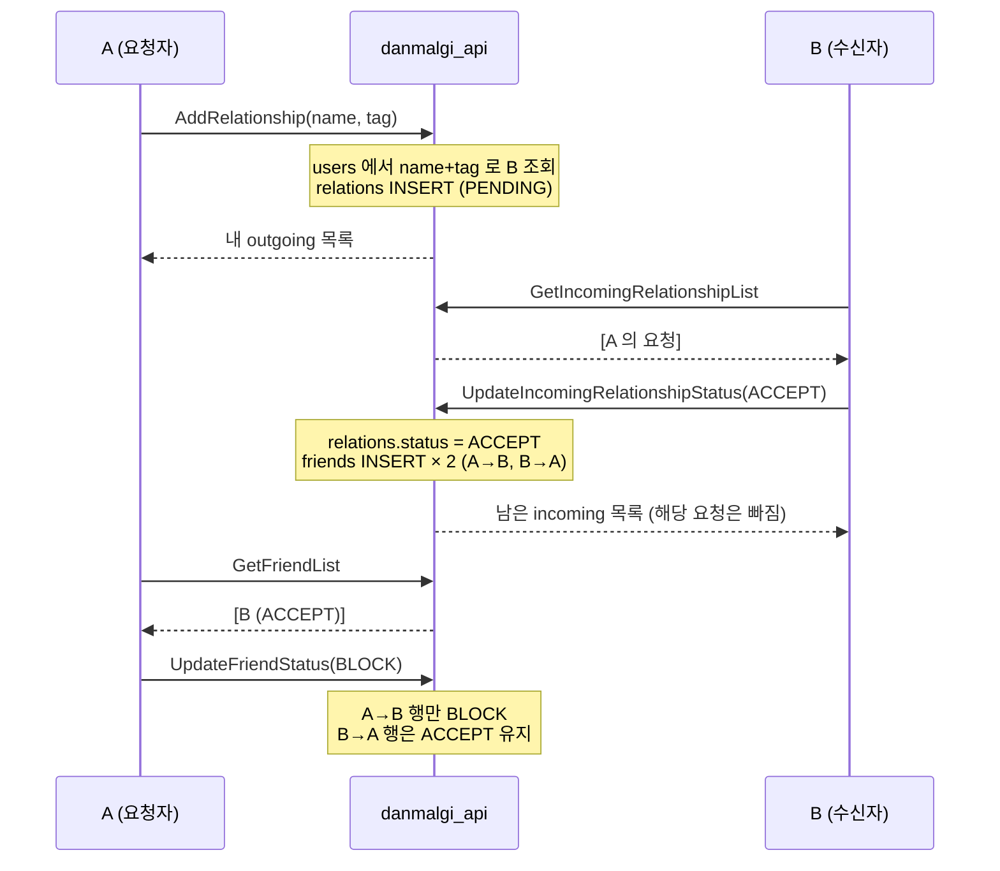

# 친구 관계 생명주기

친구 요청(**Relation**)과 친구 관계(**Friendship**)는 별개다.
이 문서는 둘의 전이 규칙과 그 사이의 연결 고리를 정리한다.

---

## 1. 두 테이블의 관계



- `relations` 는 **요청의 기록**이다. 수락되어도 행이 사라지지 않고 `status=ACCEPT` 로 남는다.
- `friends` 는 **성립된 관계**다. A→B, B→A **두 행**으로 표현된다.
- `friends` 행을 만드는 코드 경로는 `RelationService.updateIncomingRequest` **한 곳뿐**이다.

---

## 2. Relation 상태 전이



| 상태 | number | 의미 |
|---|---|---|
| `ACCEPT` | 0 | 수락됨 → `friends` 2행 생성됨 |
| `REJECT` | 1 | 거절됨 |
| `PENDING` | 2 | 대기 중 |
| `CANCEL` | 3 | 요청자가 취소함 |

### 불변 규칙
`RelationService.updateRelationshipStatus` 가 강제한다.

1. **`PENDING` 에서만 전이할 수 있다.**
   그 외 상태면 `RelationUpdateNotAllowedException`. → **종료 상태는 되돌릴 수 없다**
2. **outgoing 은 requester 만, incoming 은 receiver 만 바꿀 수 있다.**
   아니면 `RelationAccessDeniedException`
3. 자기 자신에게 요청할 수 없다 (`IllegalArgumentException`)

> ⚠️ 상태값 자체는 검증하지 않는다. outgoing 경로로 `ACCEPT`(0) 를 보내면
> 요청자가 스스로 수락 상태로 바꿀 수 있다. 다만 `friends` 행은 incoming 경로에서만
> 만들어지므로 실제 친구가 되지는 않고, **상태만 어긋난 유령 Relation** 이 남는다.

---

## 3. outgoing / incoming — 같은 행을 보는 두 시선

`relations` 한 행을 누구 관점에서 보느냐에 따라 API 가 갈린다.

| | outgoing (내가 보낸) | incoming (내가 받은) |
|---|---|---|
| 조회 조건 | `requester_id = me` | `receiver_id = me` |
| 응답의 `user` 필드 | **receiver** (상대) | **requester** (상대) |
| 허용 전이 | `CANCEL` | `ACCEPT` / `REJECT` |
| RPC | `GetOutgoingRelationshipList`<br/>`UpdateOutgoingRelationshipStatus` | `GetIncomingRelationshipList`<br/>`UpdateIncomingRelationshipStatus` |

> 두 경로 모두 응답의 `user` 는 **나 자신이 아니라 상대방**이다.
> 목록에 내 얼굴이 뜬다면 requester/receiver 매핑이 뒤집힌 것이다.

### 조회는 PENDING 만 돌려준다
`GetOutgoing/IncomingRelationshipList` 와 update 후 반환 목록 모두
`status = PENDING` 으로 필터링한다. 즉 **수락/거절/취소된 요청은 목록에서 사라진다.**
(예외: `AddRelationship` 의 반환은 `findAllByRequesterId` 라 **상태 무관 전체**를 돌려준다 — 비일관 지점)

---

## 4. 수락 시 무슨 일이 일어나는가

`RelationService.updateIncomingRequest`

```java
if (status == RelationStatus.ACCEPT.forNumber()) {
    friendshipJpaRepository.saveAll(List.of(
        FriendshipEntity.of(requester, receiver, FriendStatus.ACCEPT.getNumber()),
        FriendshipEntity.of(receiver, requester, FriendStatus.ACCEPT.getNumber())
    ));
}
```

- **2행을 한 트랜잭션에서 만든다.** 한쪽만 생기는 상태는 존재하지 않는다.
- `relations` 행은 `ACCEPT` 로 남는다 (삭제하지 않음).

### ⚠️ 중복 방지가 없다
`friends` 에 UNIQUE 제약이 없고, `AddRelationship` 도 기존 요청/친구 여부를 확인하지 않는다.
따라서:

- 같은 상대에게 요청을 여러 번 보내면 `relations` 에 **PENDING 행이 여러 개** 쌓인다
- 그것들이 각각 수락되면 `friends` 에 **같은 쌍이 중복 생성**된다
- 이미 친구인 상대에게도 다시 요청할 수 있다

새 기능이 친구 목록을 다룰 때는 **중복 행이 존재할 수 있다는 전제**로 작성해야 한다.

---

## 5. Friendship 상태

| 상태 | number | 의미 |
|---|---|---|
| `ACCEPT` | 0 | 정상 친구 |
| `BLOCK` | 1 | 차단 |
| `DELETE` | 2 | 삭제 (행은 남고 상태만 바뀐다 — **soft delete**) |



### 전이에 제약이 없다
`FriendshipService.updateFriend` 는 소유권(`findByIdAndUserId`)만 확인하고
**어떤 상태로든 바꿔준다.** Relation 과 달리 종료 상태가 없다.

### 차단/삭제는 한쪽만 바뀐다
`friends` 는 2행이지만 `updateFriend` 는 **내 쪽 1행만** 갱신한다.

- A 가 B 를 `BLOCK` 해도 B 의 목록에서 A 는 여전히 `ACCEPT` 다
- 이것은 의도된 설계로 보인다 — 차단 사실을 상대에게 노출하지 않는다
- 하지만 **차단의 실효(메시지/통화 차단)는 이 서버에 구현되어 있지 않다.**
  `friends.status` 는 현재 표시용 플래그에 가깝다

### 조회는 필터링하지 않는다
`getFriends` 는 `findAllByUserId` 로 **모든 상태를 그대로** 반환한다.
`BLOCK` / `DELETE` 를 걸러내는 것은 **클라이언트 책임**이다.

---

## 6. 전체 시나리오



---

## 7. 친구 찾기는 name + tag 로 한다

`AddRelationship` 은 userId 를 받지 않는다. `name` + `tag` 로 `users` 를 조회한다.

- 못 찾으면 `RelationUserNotFoundException`
- 그래서 `(nickname, tag)` UNIQUE 제약이 **친구 추가 기능의 전제**다
- 닉네임 변경 기능을 만들 때 이 결합을 고려해야 한다

---

## 8. 알려진 빈틈 정리

| 항목 | 현재 상태 |
|---|---|
| 중복 요청 방지 | **없음** — 같은 상대에게 PENDING 행이 여러 개 생길 수 있다 |
| 이미 친구인지 확인 | **없음** |
| `friends` UNIQUE 제약 | **없음** — 같은 쌍 중복 가능 |
| outgoing 경로의 status 값 검증 | **없음** — CANCEL 이외 값도 받아들인다 |
| 차단의 실효 (메시지/통화) | **미구현** |
| 친구 아닌 사람과 DM 채널 생성 차단 | **미구현** (`createChannel` 은 친구 여부를 보지 않는다) |
| `FriendshipService` 의 도메인 예외 | 없음 — `IllegalArgumentException` 을 던진다 |

---

## 9. 함께 볼 문서

- [domain-glossary.md](../01-foundation/domain-glossary.md) — Relation vs Friendship 요약표
- [auth-and-identity.md](auth-and-identity.md) — name/tag 제약과 UNIQUE 키
