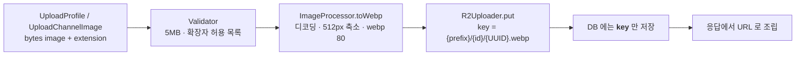

# 이미지 저장소 (Cloudflare R2)

프로필 이미지와 채널 이미지가 어떻게 들어가고 어떻게 나오는지.
**두 이미지의 URL 발급 방식이 다르다** — 이것 하나가 이 문서의 절반이다.

---

## 1. 업로드 경로



**DB 컬럼(`profile_image_url`, `channel_image_url`)에는 URL 이 아니라 object key 가 들어간다.**
컬럼 이름이 `_url` 이라 오해하기 쉽다.

---

## 2. 키 규칙

| 대상 | key | 만드는 곳 |
|---|---|---|
| 프로필 | `profiles/{userId}/{UUID}.webp` | `R2Uploader.upload` |
| 채널 | `channels/{channelId}/{UUID}.webp` | `R2Uploader.uploadChannelImage` |

- 매 업로드마다 **UUID 가 새로 붙는다.** 같은 경로를 덮어쓰지 않는다
- 그래서 오브젝트가 immutable 하고, `Cache-Control: public, max-age=31536000, immutable` 을 붙인다
- ⚠️ **이전 오브젝트를 삭제하지 않는다.** 업로드할수록 R2 에 계속 쌓인다. 정리 배치는 없다

---

## 3. URL 발급 — 여기가 핵심

| | 프로필 | 채널 |
|---|---|---|
| 메서드 | `toPublicUrl(key)` | `generatePresignedUrl(key)` |
| 결과 | `{r2.public-base-url}/{key}` | 서명된 GET URL |
| 만료 | **없음** | **1시간** (`PRESIGN_DURATION`) |
| 캐시 | ✅ Redis `user:{id}` 에 담긴다 | ❌ **담으면 안 된다** |
| 적용 시점 | 캐시 적재 **전** | 응답 조립 시 매번 |

### 왜 다른가
프로필 이미지는 **chat/webrtc 가 Redis `user:{id}` 를 직접 읽어서** 쓴다.
서명 URL 을 캐시에 넣으면 TTL 보다 먼저 만료되거나, 만료 시각이 서로 다른 값이 캐시에 남는다.
그래서 프로필만 R2 를 public 노출시키고 **만료 없는 URL** 을 쓴다.

채널 이미지는 그런 공유 계약이 없으므로 presign 으로 둔다.

### 지켜야 할 규칙
```java
// UserService.getUser — 캐시에 담기 전에 조립한다
user.applyPublicProfileImageUrl(r2Uploader);
```
캐시 히트와 미스가 **같은 값**을 내야 한다. 조립을 캐시 이후로 미루면
미스일 때만 URL 이고 히트일 때는 raw key 가 나가는 버그가 된다.

→ [messaging-flow.md](messaging-flow.md#5-접점-3---발신자-프로필), [data-model.md](../01-foundation/data-model.md#6-redis-키-전체)

### 레거시 절대 URL 처리가 서로 다르다 ⚠️
`http` 로 시작하는 값(과거에 절대 URL 을 넣던 시절의 잔재)을 만났을 때:

| | 동작 |
|---|---|
| `toPublicUrl` | **원본을 그대로 반환** |
| `generatePresignedUrl` | **빈 문자열 `""` 반환** |

의도적 차이인지 불분명하다. 채널 이미지에 레거시 값이 있으면 **이미지가 사라진다.**

---

## 4. 이미지 처리 (`ImageProcessor`)

```java
private static final int MAX_DIMENSION = 512;
private static final int WEBP_QUALITY = 80;
```

- 라이브러리: `scrimage-core` + `scrimage-webp`
- **항상 webp 로 변환한다.** 입력 확장자와 무관하게 저장 key 는 `.webp`
- 긴 변이 512px 를 넘을 때만 비율 유지 축소. 작은 이미지는 확대하지 않는다
- 디코딩 실패·인코딩 실패 모두 `InvalidImageException` → `INVALID_ARGUMENT`

> `scrimage-webp` 는 네이티브 `cwebp` 바이너리를 쓴다.
> 슬림 베이스 이미지로 도커를 바꾸면 여기서 깨질 수 있다.

---

## 5. 입력 검증

`DirectMessageGrpcValidator` (채널 이미지 기준)

| 규칙 | 값 |
|---|---|
| 최대 크기 | **5MB** (`MAX_IMAGE_SIZE`) |
| 허용 확장자 | `jpg`, `jpeg`, `png`, `gif`, `webp` (대소문자 무시) |
| `extension` 만 오고 `image` 가 없으면 | `IllegalArgumentException` |

- gRPC 메시지 `bytes` 로 **본문에 그대로 실어 보낸다.** presigned PUT 방식이 아니다
- 따라서 gRPC 기본 수신 한도(4MB)와 5MB 검증이 어긋난다.
  **4MB~5MB 이미지는 validator 에 닿기 전에 `RESOURCE_EXHAUSTED` 로 끊긴다**
- 확장자는 신뢰 대상이 아니다. 실제 판별은 `ImageProcessor` 의 디코딩이 한다
  (validator 의 확장자 검사는 조기 거부용)

---

## 6. 설정

```yaml
r2:
  endpoint:          # R2 S3 호환 엔드포인트
  access-key-id:
  secret-access-key:
  bucket:
  public-base-url: ${R2_PUBLIC_BASE_URL}   # 기본값 없음
```

- `R2Config` 가 `S3Client` 와 `S3Presigner` 를 만든다. region 은 `auto`
- **`public-base-url` 은 기본값을 두지 않아 미주입 시 기동이 막힌다(fail-fast).**
  빈 문자열로 주입되는 경우까지 `R2Uploader` 생성자의 `Assert.hasText` 가 막는다.
  그대로 두면 조립 결과가 상대 경로가 되어 **조용히 깨진다**
- 끝의 `/` 는 생성자에서 제거한다
- 선행 인프라 작업이 필요하다 — R2 의 `profiles/` 를 public 노출하고 custom domain 을 연결해야
  `toPublicUrl` 이 실제로 열린다

> ⚠️ 현재 `application.yaml` 에 R2 자격증명이 평문으로 들어 있다. 환경변수로 빼야 한다.

---

## 7. 알려진 빈틈

| 항목 | 현재 상태 |
|---|---|
| 이전 오브젝트 삭제 | **없음** — 계속 쌓인다 |
| 탈퇴/채널 삭제 시 이미지 정리 | **없음** |
| gRPC 수신 한도 vs 5MB 검증 | 어긋남 — 4MB 초과분은 `RESOURCE_EXHAUSTED` |
| 업로드 방식 | 본문 인라인. 대용량엔 presigned PUT 이 맞다 |
| 레거시 `http` 값 처리 | 두 메서드의 동작이 다르다 |
| R2 자격증명 | `application.yaml` 평문 |
| 프로필 이미지 접근 제어 | 없음 — public URL 은 키를 아는 누구나 연다 |

---

## 8. 함께 볼 문서

- [data-model.md](../01-foundation/data-model.md#5-저장소-경계) — 컬럼에 key 가 들어가는 이유
- [dm-channel-model.md](../02-domain/dm-channel-model.md#5-채널-이미지) — 채널 이미지 갱신 경로
- [error-catalog.md](../04-conventions/error-catalog.md) — `InvalidImageException` 매핑
