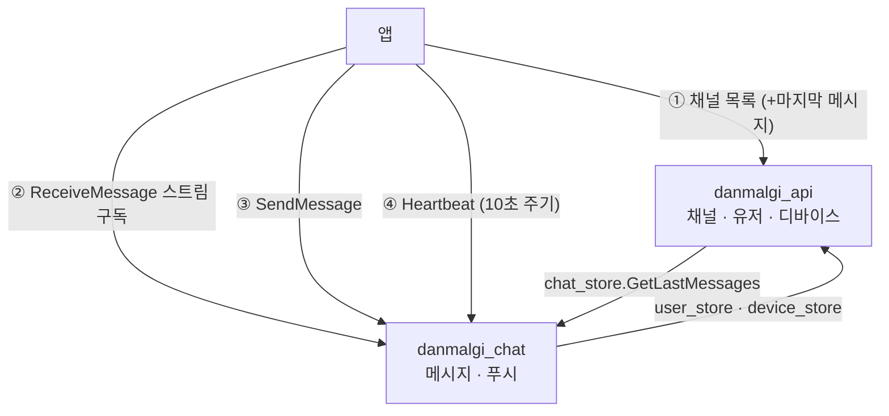
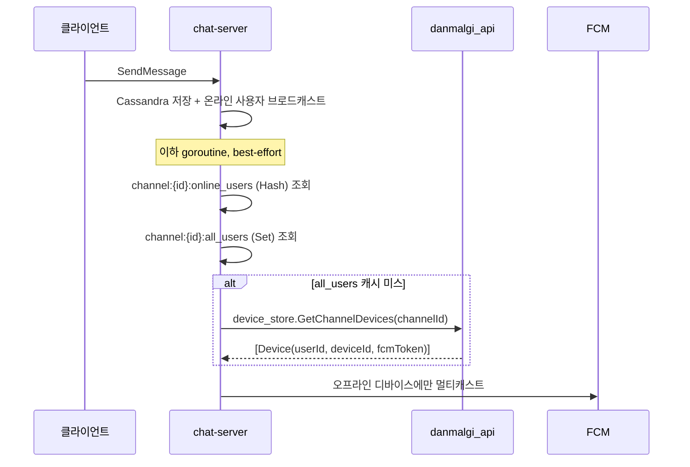

# 메시지 흐름

메시지 본문은 이 서버에 없다. 그럼에도 `danmalgi_api` 가 메시징에 깊이 관여하는 이유와,
그 접점에서 무엇을 보장해야 하는지.

---

## 1. 앱은 두 서버에 동시에 붙는다



`danmalgi_api` 는 **메시지 경로에 끼어들지 않는다.** 앱이 chat-server 를 직접 호출한다.
`external/chat/v1/chat.proto` 에 `java_package` 가 없는 이유다 — 이 서버는 그 서비스를 구현하지 않는다.

---

## 2. 이 서버가 메시징에 관여하는 3가지 접점

| 접점 | 방향 | RPC |
|---|---|---|
| **채널 목록의 마지막 메시지** | api → chat | `chat_store.GetLastMessages` |
| **푸시 대상 디바이스 제공** | chat → api | `device_store.GetChannelDevices` |
| **발신자 프로필 제공** | chat → api | `user_store.GetUsers` / Redis `user:{id}` |

나머지(저장, 브로드캐스트, 수정, 삭제, 파일)는 전부 chat-server 소관이다.

---

## 3. 접점 1 - 마지막 메시지 배치 조회

`chat/client/ChatMessageGrpcClient.java`

```java
GetLastMessagesRequest request = GetLastMessagesRequest.newBuilder()
        .addAllChannelIds(channelIds)   // 채널 전체를 한 요청으로
        .build();
```

### 규칙 1 — 정확히 1콜
채널 수와 무관하게 원격 호출은 한 번이다. **반복문 안에서 원격 호출하지 않는다.**

### 규칙 2 — graceful degrade
```java
} catch (StatusRuntimeException e) {
    log.warn("... 빈 결과로 degrade");
    return Collections.emptyMap();
}
```
chat-server 장애가 **채널 목록 조회 실패로 번지지 않는다.** 목록은 뜨고 마지막 메시지만 빈다.
이건 예외 처리가 아니라 **의도된 가용성 설계**다. 제거하면 chat 장애가 곧 DM 탭 전체 장애가 된다.

### 규칙 3 — 빈 채널은 응답에 없다
`GetLastMessagesResponse` 는 마지막 메시지가 있는 채널만 담는다.
`lastMessages.get(channelId)` 가 `null` 일 수 있고, 그대로 `DirectMessage.lastMessage` 에 들어간다.
proto 에서는 unset 으로 나간다.

### 규칙 4 — JWT 를 그대로 전달한다
`JwtForwardingClientInterceptor` 가 `GrpcContext.JWT_TOKEN` 을 꺼내
`Authorization: Bearer <token>` 으로 싣는다. 서버 전용 토큰을 새로 만들지 않는다.

> ⚠️ 따라서 **유저 컨텍스트가 없는 경로에서는 이 호출이 인증에 실패한다.**
> 배치 작업이나 internal RPC 안에서 `getLastMessages` 를 부르면 토큰이 비어 나간다.

### `last_message` 가 채널 모델 밖에 있는 이유
```protobuf
message DirectMessageChannel {
    reserved 6;
    reserved "last_message";   // DirectMessageChannelListItem 로 이동
}
```
채널 생성·수정 응답에는 마지막 메시지가 없다. **목록 응답에서만** 의미가 있어서
`DirectMessageChannelListItem` 으로 분리했다. 필드 번호는 `reserved` 로 봉인했다.

---

## 4. 접점 2 - 오프라인 푸시

푸시는 chat-server 가 보낸다. 이 서버는 **대상 디바이스를 제공**할 뿐이다.



### 온라인/오프라인은 이 서버가 모른다
판정은 chat-server 의 Redis `channel:{id}:online_users` (Hash, **필드 TTL 30초**) 로 한다.

**TTL 연장은 클라이언트의 `Heartbeat` RPC 로만 이뤄진다** (권장 주기 10초).
서버 스트림의 생존 여부로 판단하지 않는다 — 스트림이 살아 있어도 앱이 백그라운드면
메시지를 볼 수 없기 때문이다.

> `danmalgi_api` 코드 어디에도 "온라인" 개념이 없는 것이 정상이다.
> 접속 상태를 물어보는 요구가 오면 chat-server 소관이다.

### `GetChannelDevices` 가 하는 일
```java
// DeviceService
채널의 UDMC 행 → userId 목록 → 그 유저들의 devices 전부
```
- **필터링하지 않는다.** 발신자 본인 제외, 온라인 제외는 chat-server 몫이다
- 한 유저의 **모든 디바이스**를 돌려준다
- 여기 결과가 비면 푸시가 통째로 사라진다. 채널 참여자(UDMC)가 정확해야 푸시가 정확하다

### FCM 토큰 등록
`AuthService.upsertFcmToken` (`AuthService/UpsertFcmToken`)

```java
deviceJpaRepository.findFirstByDeviceId(deviceId)   // 있으면 토큰 갱신
    .orElseGet(() -> DeviceEntity.of(userEntity, deviceId, fcmToken));
deviceService.putDevice(deviceId, ...);              // Redis device:{deviceId} 갱신
```

- `deviceId` 는 **JWT 클레임에서** 온다. 요청 필드가 아니다
- pending 유저는 호출할 수 없다 — `devices.user_id` FK 때문에 저장 자체가 불가능하다
- ⚠️ **`devices.device_id` 에 UNIQUE 제약이 없다.** `findFirstByDeviceId` 의 `First` 가 그 증거다.
  같은 deviceId 행이 여러 개면 갱신되지 않는 행이 남아 **죽은 FCM 토큰으로 푸시가 나간다**
- ⚠️ 메서드 이름은 `updateUserIdAndFcmToken` 인데 **`user` 는 갱신하지 않는다.**
  한 기기에서 계정을 바꿔 로그인해도 `devices.user_id` 는 이전 소유자를 가리킨 채로 남는다

---

## 5. 접점 3 - 발신자 프로필

chat-server 는 메시지에 실을 `user.v1.User` 를 두 경로로 얻는다.

1. Redis `user:{id}` 직접 GET / MGET
2. 미스면 `user_store.GetUsers` gRPC

### `user:{id}` 는 캐시가 아니라 계약이다

| | |
|---|---|
| 쓰기 주체 | **danmalgi_api 단독.** chat-server 는 읽기 전용, write-back 도 하지 않는다 |
| TTL | 2분 (`RedisConfig` 의 `cacheConfigs.put("user", ...)`) |
| 키 접두 | `computePrefixWith(cacheName -> cacheName + ":")` → `user:{id}` (기본값 `user::{id}` 가 아니다) |
| 값 | `User` JSON. `profile_image_url` 은 **조립된 public URL** |

여기서 따라오는 책임:

- **히트율과 신선도를 chat-server 가 통제할 수 없다.** 전적으로 이 서버의 쓰기 시점과 TTL 에 달렸다
- **무효화 수단이 chat 쪽에 없다.** 탈퇴·차단·프로필 변경이 늦게 반영되면 이 서버의 문제다
  (`UserService.uploadProfile` 이 `redisTemplate.delete("user:" + userId)` 로 지우는 이유)
- **값 모양을 바꾸면 chat-server 가 깨진다.** `applyPublicProfileImageUrl` 을 캐시 적재 **전에**
  호출하는 것은 이 계약을 지키기 위해서다

> `computePrefixWith` 를 지우면 키가 `user::{id}` 가 되어 **chat-server 의 캐시 히트가 0%** 가 된다.
> 장애가 나지 않고 조용히 gRPC 폴백만 늘기 때문에 발견이 늦다.

---

## 6. 메시지 수정·삭제

`MessageStatus` (`NONE` / `MODIFIED` / `DELETED`) 는 `ReceiveMessageResponse` 에 실려 온다.
**chat-server 가 스트림으로 알린다.** 이 서버는 관여하지 않는다.

채널 목록의 마지막 메시지가 삭제된 경우의 처리도 chat-server 소관이다
(`GetLastMessages` 응답에 무엇이 오는지에 이 서버는 관여하지 않는다).

---

## 7. 알려진 빈틈

| 항목 | 현재 상태 |
|---|---|
| `devices.device_id` UNIQUE | **없음** — 중복 행 → 죽은 토큰으로 푸시 |
| 기기 재로그인 시 `devices.user_id` 갱신 | **없음** — 이전 소유자에게 푸시가 갈 수 있다 |
| 로그아웃 시 FCM 토큰 제거 | **없음** |
| 차단한 상대의 메시지 푸시 차단 | **없음** (`friends.status` 가 실효되지 않는다) |
| 채널 목록 참여자 조회 N+1 | 있음 → [dm-channel-model.md](../02-domain/dm-channel-model.md#6-채널-목록-조회) |
| `chat-server.address` 운영 값 | `application.yaml` 에 dev 기본값(`localhost:8082`) TODO 로 남아 있다 |

---

## 8. 함께 볼 문서

- [dm-channel-model.md](../02-domain/dm-channel-model.md) — 채널과 참여자
- [system-architecture.md](../01-foundation/system-architecture.md) — 서버 책임 경계
- `danmalgi_chat/docs/fcm-push-message.md` — 푸시 설계 원본
- `danmalgi_chat/docs/redis-cache-keys.md` — chat 쪽에서 본 `user:{id}` 계약
