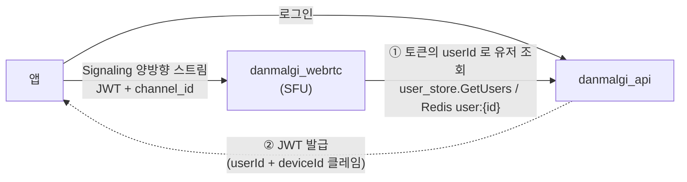

# WebRTC 시그널링 — danmalgi_api 의 몫

**시그널링은 이 서버가 하지 않는다.** `danmalgi_webrtc` 소관이다.
이 문서는 그 경계에서 `danmalgi_api` 가 무엇을 제공하고, 무엇을 깨뜨릴 수 있는지만 다룬다.

> 시그널링 흐름 자체(SFU 토폴로지, offer 주체, 트랙 팬아웃, 재협상, 종료)는
> **`danmalgi_webrtc/docs/webrtc-signaling-flow.md`** 가 정본이다. 여기서 복제하지 않는다.

---

## 1. 이 서버의 역할은 두 가지뿐



| 역할 | 어디서 |
|---|---|
| **JWT 발급** | `JwtTokenProvider` — webrtc 가 이 토큰을 같은 시크릿으로 검증한다 |
| **유저 프로필 제공** | `user_store.GetUsers` + Redis `user:{id}` |

그 외(SDP, ICE, 트랙, 채널 상태)는 전부 webrtc-server 안에서 끝난다.
**`danmalgi_api` 코드에 통화 관련 상태가 없는 것이 정상이다.**

---

## 2. proto 소유권

`src/main/proto/external/signaling/v1/signaling.proto` 는 이 리포에도 있지만
`java_package` 가 **없다** (`go_package` 만 있다). 즉:

- 이 서버는 `SignalingService` 를 **구현하지 않는다**
- Java 코드도 생성되지 않는다
- submodule 로 공유되기 때문에 파일만 함께 딸려 온다

→ [grpc-contract.md](../04-conventions/grpc-contract.md#2-누가-이-proto-의-주인인가)

### 계약 표면 (참고용)
| 메시지 | 방향 | oneof |
|---|---|---|
| `SignalingRequest` | C → S | `answer`, `candidate` |
| `SignalingResponse` | S → C | `offer`, `answer`*, `candidate` |

<sub>* proto 에 정의만 있고 서버는 보내지 않는다</sub>

`Offer.joined_user_tracks` 가 참여자 트랙 목록을 싣는데, 그 안의 `UserTrack.user` 가
**`user.v1.User`** 다. 이 타입이 `danmalgi_api` 와의 유일한 데이터 접점이다.

| `TrackType` | 값 |
|---|---|
| `AUDIO` / `CAM_AUDIO` / `CAM_VIDEO` / `SCREEN_AUDIO` / `SCREEN_VIDEO` | 0~4 |

---

## 3. JWT 는 두 서버가 공유한다

webrtc-server 는 스트림 개시 시 메타데이터의 `authorization` 을 **같은 HS256 시크릿으로**
검증하고, `userId` 로 `GetUserByID` 를 호출한다.

따라서 **`jwt.secret` 은 두 리포가 같은 값이어야 한다.** 어긋나면 로그인은 되는데
통화만 안 되는 형태로 나타난다.

### deviceId 클레임이 presence 키다
webrtc 는 Redis presence Hash 의 **field 로 `deviceId`** 를 쓴다.
`JwtTokenProvider` 가 `deviceId` 를 필수 클레임으로 강제하는 이유가 여기에도 있다.

> **같은 deviceId 로 두 연결이 붙으면** 한 칸을 공유해서,
> 한쪽 종료가 상대의 presence 까지 지운다. 클라이언트가 연결마다 고유한
> deviceId 를 만들어야 한다는 뜻이다 — 서버가 강제하지 않는다.

### ⚠️ JWT 에 만료가 없다
[auth-and-identity.md](../02-domain/auth-and-identity.md#6-jwt) 참고. 통화 세션에도 그대로 적용된다.

---

## 4. `user_store.GetUsers` 의 동작이 webrtc 안정성에 직결된다

`UserService.getUsers` 는 **부분 응답을 돌려주지 않는다.**

```java
Set<Long> foundIds = result.stream().map(User::getId).collect(Collectors.toSet());
for (Long id : userIds) {
    if (!foundIds.contains(id)) {
        throw new UserNotFoundException("user not found: " + id);
    }
}
```

요청한 id 중 **하나라도 없으면 통째로 `NOT_FOUND`** 다. 빈 목록이나 일부 목록이 나가지 않는다.

이 계약이 중요한 이유는 webrtc 쪽에 다음 이슈가 있기 때문이다:

> `internal/usecase/service/user_service.go` 가 `response.Users[0]` 을 무조건 인덱싱한다.
> 응답이 비면 **index out of range 패닉**이다.
> (`danmalgi_webrtc/docs/known-issues.md` — 우선순위 항목)

즉 **`GetUsers` 가 빈 목록을 반환하도록 바꾸면 webrtc 가 죽는다.**
지금은 에러로 나가므로 Go 쪽에서 `err != nil` 로 걸러진다.

> 응답 형태를 "없는 id 는 조용히 빼고 반환" 으로 완화하고 싶다면,
> **webrtc 의 인덱싱 방어가 먼저 들어가야 한다.** 순서를 바꾸면 프로세스가 패닉한다.

### 프로필 이미지 URL 도 같은 이유로 조립 후 캐시한다
webrtc 는 Redis `user:{id}` 를 직접 읽는다. 캐시에 R2 key 가 들어 있으면
통화 화면의 프로필 이미지가 깨진다 → [messaging-flow.md](messaging-flow.md#5-접점-3---발신자-프로필)

---

## 5. 채널 id 의 의미

시그널링 스트림은 `channel_id` 로 방을 고른다.
이 값은 `direct_message_channels.id` 와 **같은 공간**이다.

- 즉 DM 채널이 곧 통화방이다
- ⚠️ 다만 **webrtc 는 참여 자격을 이 서버에 확인하지 않는다.**
  UDMC 에 없는 사람도 channel_id 만 알면 붙을 수 있다
- 채널 삭제 기능이 없어서 지금은 고아 통화방 문제가 표면화되지 않았다

---

## 6. 이 서버를 고칠 때 webrtc 를 깨뜨리는 변경

| 변경 | 증상 |
|---|---|
| `jwt.secret` 을 한쪽만 교체 | 로그인은 되는데 통화 연결만 실패 |
| JWT 에서 `deviceId` 클레임 제거 | presence 등록 불가 |
| `user:{id}` 키 접두사 변경 (`computePrefixWith`) | 캐시 히트 0%, gRPC 폴백 폭증 |
| `user:{id}` 값에 R2 key 저장 | 통화 화면 프로필 이미지 깨짐 |
| `GetUsers` 를 부분 응답으로 변경 | **webrtc 프로세스 패닉** |
| `user.v1.User` 필드 번호 변경 | 트랙의 사용자 정보 오염 |

---

## 7. 함께 볼 문서

- `danmalgi_webrtc/docs/webrtc-signaling-flow.md` — 시그널링 전체 흐름 (정본)
- `danmalgi_webrtc/docs/known-issues.md` — `GetUsers` 패닉 이슈
- [grpc-contract.md](../04-conventions/grpc-contract.md) — proto 소유권과 인증 라우팅
- [auth-and-identity.md](../02-domain/auth-and-identity.md) — JWT 클레임
