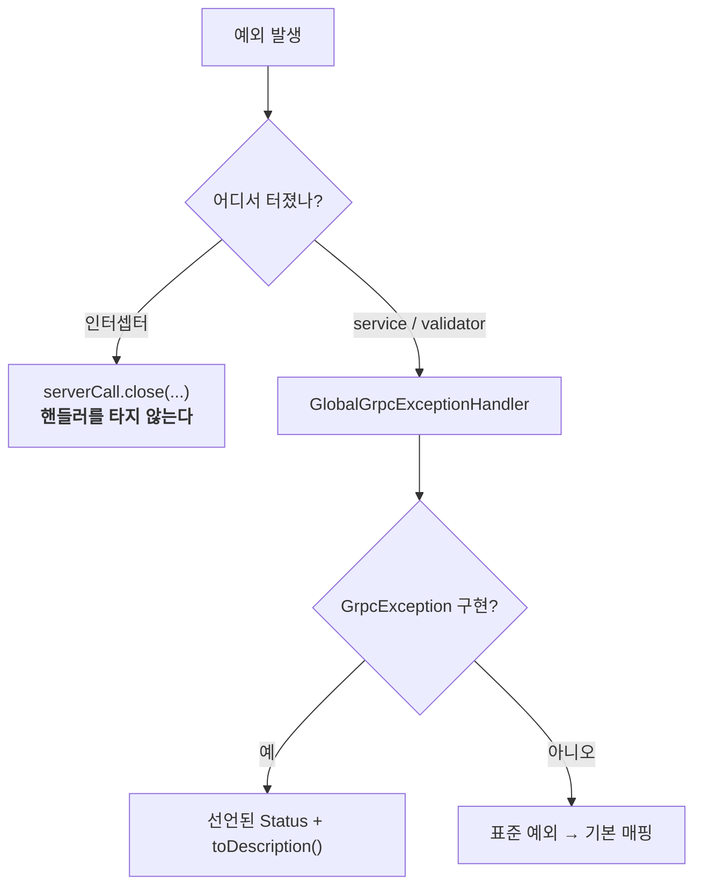

# 에러 카탈로그

도메인 예외가 어떤 gRPC status 로 나가는지, 클라이언트가 무엇으로 분기할 수 있는지.

---

## 1. 두 갈래 경로



> **인터셉터에서 던진 예외는 `GlobalGrpcExceptionHandler` 를 타지 않는다.**
> 그래서 `GrpcAuthInterceptor` 는 `serverCall.close(Status..., new Metadata())` 로 직접 닫는다.
> 인터셉터에 새 실패 경로를 추가할 때 `throw` 로 쓰면 `UNKNOWN` 이 나간다.

---

## 2. 도메인 예외 (`GrpcException` 구현)

`getStatus()` 와 `toDescription()` 을 직접 선언한다. **이게 정본이다.**

| 예외 | Status | 언제 |
|---|---|---|
| `UserNotFoundException` | `NOT_FOUND` | 유저 조회 실패 |
| `DuplicatedUserException` | `ALREADY_EXISTS` | name+tag 중복 |
| `UserValidateException` | `INVALID_ARGUMENT` | name/tag 형식 위반 (blank, 16자/5자 초과) |
| `OauthAuthorizeFailException` | `UNAUTHENTICATED` | OAuth idToken 검증 실패 |
| `PendingRegistrationNotFoundException` | `UNAUTHENTICATED` | pending 세션 만료 + `users` 행도 없음 |
| `UnsupportedOauthTypeException` | `UNIMPLEMENTED` | 미지원 `OauthType` |
| `RelationNotFoundException` | `NOT_FOUND` | relationId 없음 |
| `RelationUserNotFoundException` | `NOT_FOUND` | name+tag 로 상대를 못 찾음 |
| `RelationAccessDeniedException` | `PERMISSION_DENIED` | 내 요청이 아닌 것을 수정 |
| `RelationUpdateNotAllowedException` | `FAILED_PRECONDITION` | `PENDING` 이 아닌 요청을 수정 |
| `NotGroupChannelException` | `FAILED_PRECONDITION` | 1:1 방에 그룹 전용 작업 |
| `InvalidImageException` | `INVALID_ARGUMENT` | 디코딩 실패 / webp 인코딩 실패 |

### 사용처 없는 예외
| 예외 | 선언된 Status |
|---|---|
| `AuthUserNotFoundException` | `NOT_FOUND` |
| `InvalidRelationStatusException` | `INVALID_ARGUMENT` |

둘 다 **던지는 코드가 없다.** 지우거나, 원래 의도된 자리에 넣어야 한다
(`InvalidRelationStatusException` 은 outgoing 경로의 상태값 검증 자리로 보인다 →
[relationship-lifecycle.md](../02-domain/relationship-lifecycle.md#2-relation-상태-전이)).

---

## 3. 표준 예외 기본 매핑

`GlobalGrpcExceptionHandler` 의 switch 순서 그대로다. 위에서부터 먼저 걸린다.

| 예외 | Status | 기본 description |
|---|---|---|
| `StatusException` | 그대로 통과 | — |
| `GrpcException` | 선언된 값 | `toDescription()` |
| `StatusRuntimeException` | 그대로 통과 (trailers 유지) | — |
| `IllegalArgumentException` | `INVALID_ARGUMENT` | `Invalid request` |
| `DataIntegrityViolationException` | `ALREADY_EXISTS` | `Resource already exists` |
| `AccessDeniedException` | `PERMISSION_DENIED` | `Permission denied` |
| `SecurityException` | `PERMISSION_DENIED` | `Permission denied` |
| `NoSuchElementException` | `NOT_FOUND` | `Resource not found` |
| `UnsupportedOperationException` | `UNIMPLEMENTED` | `Operation not implemented` |
| `IllegalStateException` | `FAILED_PRECONDITION` | `Request cannot be processed in the current state` |
| 그 외 | `INTERNAL` | `Internal server error` |

### 이 매핑이 만드는 함정

- **`DataIntegrityViolationException` → `ALREADY_EXISTS`** 는 UNIQUE 위반을 가정한다.
  하지만 FK 위반·NOT NULL 위반도 같은 예외다. 그 경우 "이미 존재한다"는 틀린 메시지가 나간다
- **`IllegalStateException` → `FAILED_PRECONDITION`** 이라 내부 설정 오류가 클라이언트 잘못처럼 보인다.
  예: `users` 시퀀스 미존재(`AuthService.resolvePendingUserId`)는 서버 결함인데 `FAILED_PRECONDITION` 이 나간다
- **`NoSuchElementException` → `NOT_FOUND`** 덕에 `UserDirectMessageChannelService.getUserChannel` 은
  전용 예외 없이도 올바른 status 를 낸다. 의도적인 활용이다

---

## 4. description 에 내부 정보가 그대로 나간다

```java
private String messageOrDefault(Throwable ex, String defaultMessage) {
    String message = ex.getMessage();
    return (message == null || message.isBlank()) ? defaultMessage : message;
}
```

**예외 메시지가 그대로 클라이언트에 전달된다.** 기본 문구는 메시지가 비었을 때만 쓰인다.
`default -> Status.INTERNAL` 가지도 마찬가지라, 잡히지 않은 예외의 원문
(SQL 문법 오류, 스택 내부 메시지 등)이 앱까지 나갈 수 있다.

> 운영 전에 손봐야 할 항목이다. 최소한 `INTERNAL` 가지만이라도
> 로깅은 원문, 응답은 고정 문구로 분리하는 편이 낫다.

또한 도메인 예외의 메시지에 식별자가 들어 있다:
```
"receiver user not found: name=홍길동, tag=1234"
"user direct message channel not found: userId=42, channelId=7"
```
디버깅에는 좋지만 **존재 여부를 탐침당할 수 있다.**

---

## 5. 인증 실패 (인터셉터)

`GrpcAuthInterceptor` 가 직접 닫는 status.

| 조건 | Status | description |
|---|---|---|
| `Authorization` 헤더 없음/빈 값 | `UNAUTHENTICATED` | `authorization header is missing` |
| `Bearer ` 접두사 아님 | `UNAUTHENTICATED` | `authorization header must use Bearer token` |
| 토큰 부분이 빈 값 | `UNAUTHENTICATED` | `Bearer token is missing` |
| 서명 불일치 / 파싱 실패 / 만료 | `UNAUTHENTICATED` | `invalid jwt token` |
| `users` 행도 pending 세션도 없음 | `UNAUTHENTICATED` | `user not found for token` |
| pending 인데 허용 목록 밖 RPC | `FAILED_PRECONDITION` | `user registration is not completed` |

### 클라이언트 분기 지침
- `UNAUTHENTICATED` → **재로그인**
- `FAILED_PRECONDITION` + `registration is not completed` → **닉네임 입력 화면으로**

두 경우의 대응이 다르므로 status 만으로 뭉뚱그리면 안 된다.

---

## 6. validator 규약

`*GrpcValidator` 는 **`IllegalArgumentException` 만** 던진다 → 전부 `INVALID_ARGUMENT`.

```java
if (request.getName().isBlank()) throw new IllegalArgumentException("name must not be blank");
if (relationshipId <= 0) throw new IllegalArgumentException("relationshipId must be positive");
if (status == RelationshipProto.RelationshipStatus.UNRECOGNIZED) throw new IllegalArgumentException("relationshipStatus is invalid");
```

- 검사 범위는 **형식뿐이다** — blank, 양수, `UNRECOGNIZED`
- "존재하는가 / 권한이 있는가"는 service 가 도메인 예외로 처리한다
- proto3 는 unset 과 기본값을 구분하지 않는다. `0` / `""` 이 "안 보냈다"인지 "0을 보냈다"인지
  알 수 없으므로 **validator 가 그 경계를 대신 만든다**

---

## 7. 클라이언트가 기대해도 되는 status

| Status | 뜻 | 앱의 대응 |
|---|---|---|
| `UNAUTHENTICATED` | 토큰 문제 | 재로그인 |
| `FAILED_PRECONDITION` | 상태가 맞지 않음 | 화면 전환 또는 안내 |
| `INVALID_ARGUMENT` | 입력 형식 오류 | 입력 수정 유도 |
| `ALREADY_EXISTS` | 중복 (주로 name+tag) | 다른 값 입력 유도 |
| `NOT_FOUND` | 대상 없음 | 목록 갱신 |
| `PERMISSION_DENIED` | 내 것이 아님 | 목록 갱신 |
| `UNIMPLEMENTED` | 미지원 | 앱 업데이트 안내 |
| `INTERNAL` | 서버 오류 | 재시도 |

> **description 문자열로 분기하지 않는다.** 위 표에서 예외적으로 허용하는 것은
> pending 판별(§5) 하나뿐이고, 이것도 전용 status 나 error detail 로 옮기는 편이 낫다.

---

## 8. 개선 여지

| 항목 | 현재 |
|---|---|
| `INTERNAL` 응답에 내부 메시지 노출 | 그대로 나간다 |
| 에러 코드 체계 (`google.rpc.ErrorInfo` 등) | **없음** — status + 문자열뿐 |
| `DataIntegrityViolationException` 세분화 | UNIQUE/FK/NOT NULL 이 전부 `ALREADY_EXISTS` |
| `IllegalStateException` 의 이중 의미 | 서버 결함과 클라이언트 상태 오류가 같은 status |
| 미사용 예외 2종 | 방치 |
| `FriendshipService` 의 도메인 예외 | 없음 — `IllegalArgumentException` 을 쓴다 (`INVALID_ARGUMENT`. 의미상 `NOT_FOUND` 가 맞다) |

---

## 9. 함께 볼 문서

- [grpc-contract.md](grpc-contract.md) — validator/mapper/service 레이어 규칙
- [auth-and-identity.md](../02-domain/auth-and-identity.md) — pending 허용 목록과 판정 순서
