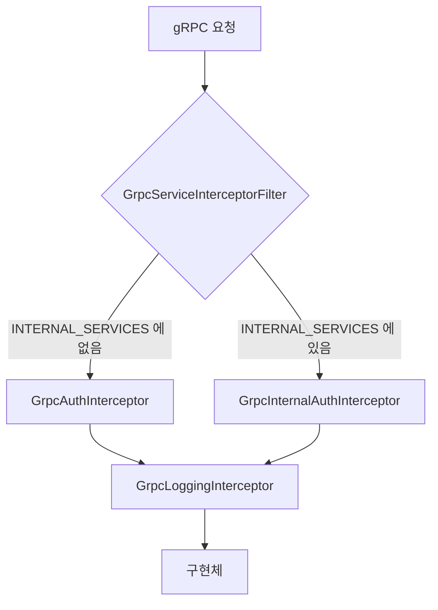

# gRPC 계약

프로토콜 경계에서 지켜야 하는 규칙. proto 파일의 **정본은 `src/main/proto/`** 이고,
이 문서는 그 구조가 왜 그렇게 나뉘어 있는지와 어기면 무엇이 깨지는지를 다룬다.

---

## 1. 디렉터리 구조가 곧 인증 정책이다

```
src/main/proto/
├── external/     ← 앱 클라이언트가 호출. 유저 JWT 필요
│   ├── auth/v1/          auth.proto
│   ├── user/v1/          user.proto
│   ├── friend/v1/        friend.proto
│   ├── relationship/v1/  relationship.proto
│   ├── dm/v1/            dm.proto
│   ├── chat/v1/          chat.proto        ← chat-server 소유
│   ├── signaling/v1/     signaling.proto   ← webrtc-server 소유
│   └── etc/              room.proto        ← 레거시
└── internal/     ← 서버 간 호출. 유저 JWT 없음
    ├── user_store/v1/
    ├── dm_store/v1/
    ├── device_store/v1/
    └── chat_store/v1/    ← chat-server 소유 (방향 반대)
```

`build.gradle` 의 `srcDirs = ['src/main/proto/external', 'src/main/proto/internal']` 이
**두 디렉터리를 각각 import 루트로** 삼는다. 그래서 import 경로에 `external/` 이 없다:

```protobuf
import "user/v1/user.proto";   // ✅
import "external/user/v1/user.proto";  // ❌ 컴파일 실패
```

---

## 2. 누가 이 proto 의 주인인가

`java_package` 옵션이 **있으면 이 서버가 구현자**, 없으면 다른 서버의 계약이다.

| proto | `java_package` | 구현자 | danmalgi_api 의 역할 |
|---|---|---|---|
| `auth`, `user`, `friend`, `relationship`, `dm` | ✅ | danmalgi_api | 서버 |
| `user_store`, `dm_store`, `device_store` | ✅ | danmalgi_api | 서버 |
| `chat_store` | ✅ | **chat-server** | **클라이언트** |
| `chat` | ❌ (`go_package` 만) | chat-server | 없음 — 앱이 직접 호출 |
| `signaling` | ❌ | webrtc-server | 없음 |
| `etc/room` | ❌ | — | **레거시. 사용처 없음** |

> `chat_store` 만 `java_package` 가 있으면서 구현자가 아니다. 이 서버는 스텁만 쓴다
> (`ChatClientConfig`). 다른 `*_store` 와 방향이 반대라는 점을 헷갈리기 쉽다.

proto 는 **git submodule** 로 3개 리포가 공유한다. 계약을 바꾸면 submodule 을 함께 올려야 한다.

---

## 3. 인증 라우팅



`GrpcServiceInterceptorFilter.INTERNAL_SERVICES` 에 서비스 **풀네임**을 등록한다.

```java
private static final Set<String> INTERNAL_SERVICES = Set.of(
    UserStoreServiceGrpc.SERVICE_NAME,
    DmStoreServiceGrpc.SERVICE_NAME,
    DeviceStoreServiceGrpc.SERVICE_NAME
);
```

### 왜 allowlist 인가
proto 의 `package` 에는 `internal` 접두어가 **없다** (`user_store.v1`).
`internal` 은 디렉터리와 `java_package` 에만 있다. 즉 **런타임 서비스 이름만 봐서는
external/internal 을 구분할 수 없다.**

allowlist 라 **fail-closed** 다 — 등록을 잊은 새 internal 서비스는 유저 JWT 를 요구하게 되어
서버 간 호출이 `UNAUTHENTICATED` 로 실패한다. 조용히 무인증으로 열리지는 않는다.

### ⚠️ internal 은 현재 무인증이다
`GrpcInternalAuthInterceptor` 는 검증 없이 통과시킨다. internal 서비스가 external 과
**같은 8080 포트**에 올라가 있으므로, 포트에 닿을 수 있으면 `user_store.GetUsers` 를
누구나 호출할 수 있다. 공유 시크릿 헤더 또는 mTLS peer 검증을 넣을 자리만 잡아둔 상태다.

---

## 4. 인증을 건너뛰는 RPC

`GrpcAuthInterceptor` 기준.

| 메서드 | 처리 |
|---|---|
| `auth.v1.AuthService/Authorization` | **무조건 통과** — 토큰이 없는 유일한 진입점 |
| `grpc.reflection.v1.ServerReflection/*` | `auth.interceptor.enable=true` 일 때만 통과 |
| `AuthService/Register`, `UserService/VerifyNameAndTag` | 토큰은 필요. **pending 세션도 허용** |
| 그 외 | 유효한 JWT + `users` 행 필요 |

자세한 판정 순서는 [auth-and-identity.md](../02-domain/auth-and-identity.md#5-pending-상태에서-할-수-있는-일).

> `auth.interceptor.enable` 은 이름과 달리 인터셉터 자체를 끄지 않는다.
> **reflection 허용 여부**만 바꾼다.

---

## 5. Context 로 흐르는 값

인터셉터가 검증 후 `GrpcContext` 에 심고, 구현체는 요청 필드가 아니라 여기서 꺼낸다.

```java
Long userId = GrpcContext.USER_ID.get();     // 요청에 user_id 필드를 두지 않는다
String deviceId = GrpcContext.DEVICE_ID.get();
```

| 키 | 출처 | 없을 수 있나 |
|---|---|---|
| `USER_ID` | JWT `userId` 클레임 | 아니오 |
| `DEVICE_ID` | JWT `deviceId` 클레임 | 아니오 |
| `JWT_TOKEN` | 원본 Bearer 토큰 | 아니오 |
| `USER` | `UserService.getUser` | **예** — pending 이면 없음 |

> **요청 메시지에 `user_id` 를 넣지 않는다.** 호출자가 남의 id 를 보낼 수 있게 된다.
> 이 서버의 external RPC 중 자기 id 를 인자로 받는 것은 하나도 없다.

### JWT 포워딩
`JwtForwardingClientInterceptor` 가 `GrpcContext.JWT_TOKEN` 을 꺼내 chat-server 호출의
`Authorization: Bearer <token>` 헤더에 싣는다. 서버가 새 토큰을 발급하지 않고
**클라이언트 원본을 그대로 전달**한다.

---

## 6. 레이어 규칙

```
GrpcService 구현체
  ├─ validator  : 요청 필드 검증. IllegalArgumentException 만 던진다
  ├─ mapper     : proto ↔ domain 변환
  └─ service    : 비즈니스 로직. proto 타입을 모른다
```

- **proto 타입은 `grpc/` 패키지를 넘지 않는다.** `service` 시그니처에 `XxxProto.Yyy` 가
  보이면 경계가 샌 것이다.
- `validator` 는 "형식"만 본다 (blank, 양수, `UNRECOGNIZED`).
  "존재하는가 / 권한이 있는가" 는 `service` 몫이다.
- `StreamObserver` 도 `grpc/` 안에서만 다룬다.

### enum 매핑
proto enum 과 도메인 enum은 **number 로 맞춘다**. 값이 어긋나면 조용히 오염되므로
enum 에 값을 추가할 때 양쪽을 같이 본다.

| 도메인 | proto |
|---|---|
| `UserStatus` 0~3 | `UserStatus.USER_PENDING`~`USER_WITHDRAWAL` |
| `OauthType` 0~2 | `OauthType.NAVER/GOOGLE/KAKAO` |
| `RelationStatus` 0~3 | `RelationshipStatus` |
| `FriendStatus` 0~2 | `FriendStatus` |

`UNRECOGNIZED` 는 validator 에서 `INVALID_ARGUMENT` 로 막는다.

---

## 7. 버저닝

- 패키지에 `v1` 을 붙인다 (`dm.v1`). 디렉터리도 `v1/`.
- 호환 불가 변경은 **필드 번호를 재사용하지 않고 `reserved`** 처리한다. 실제 예:

```protobuf
message DirectMessageChannel {
    reserved 6;
    reserved "last_message";  // DirectMessageChannelListItem 로 이동
}
```

- 필드 삭제 시 `reserved` 를 남기지 않으면 구버전 클라이언트가 **엉뚱한 타입으로 역직렬화**한다.
- 새 v2 패키지를 만들기 전에, 필드 추가로 해결되는지 먼저 본다.

---

## 8. 스트리밍

현재 이 서버가 구현하는 RPC 는 **전부 unary** 다.
스트리밍은 다른 서버 소관이며 앱이 직접 연결한다.

| 스트림 | 서버 |
|---|---|
| `ChatService/ReceiveMessage` (server stream) | chat-server |
| `SignalingService/Signaling` (bidi stream) | webrtc-server |

---

## 9. 함께 볼 문서

- [system-architecture.md](../01-foundation/system-architecture.md) — 서버 간 호출 방향
- [error-catalog.md](error-catalog.md) — 예외 → status 매핑
- [auth-and-identity.md](../02-domain/auth-and-identity.md) — JWT 클레임과 pending 허용 목록
